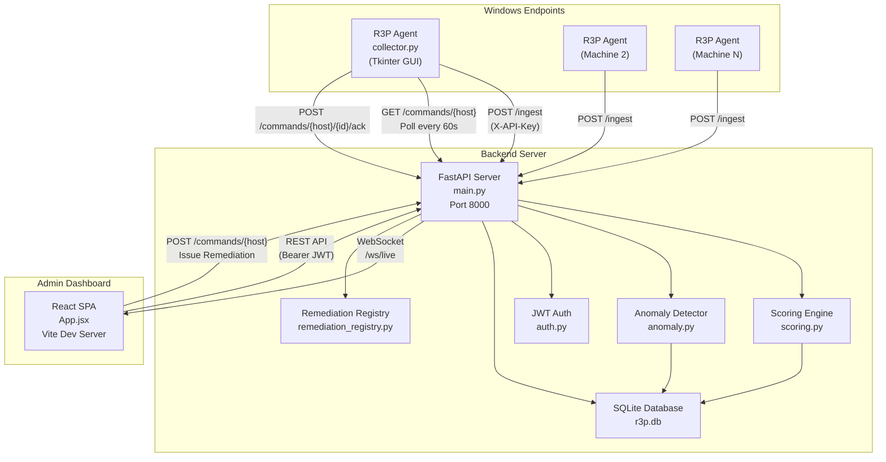
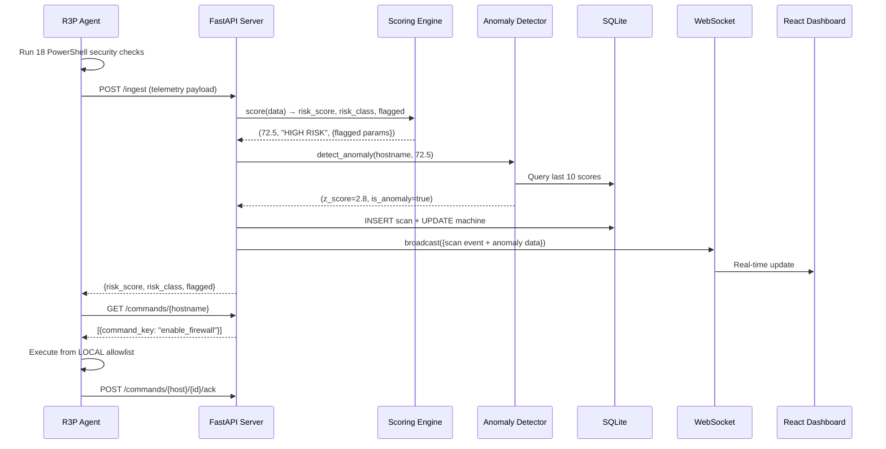
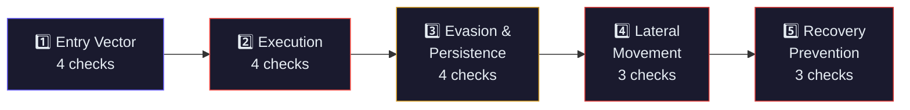

<p align="center">
  <strong>🛡 R3P — Ransomware Readiness & Risk Profiler</strong>
</p>

<p align="center">
  <em>An intelligent, agent-based platform for continuous ransomware vulnerability assessment, risk scoring, anomaly detection, and automated remediation of Windows endpoints — mapped to the MITRE ATT&CK framework.</em>
</p>

<p align="center">
  
  
  
  
  
</p>

---

## 📋 Table of Contents

1. [Abstract](#abstract)
2. [Problem Statement](#problem-statement)
3. [Scope & Objectives](#scope--objectives)
4. [System Architecture](#system-architecture)
5. [Technology Stack](#technology-stack)
6. [Key Features](#key-features)
7. [Ransomware Kill-Chain Model](#ransomware-kill-chain-model)
8. [MITRE ATT&CK Mapping](#mitre-attck-mapping)
9. [Risk Scoring Formula](#risk-scoring-formula)
10. [Anomaly Detection Algorithm](#anomaly-detection-algorithm)
11. [Remediation Engine](#remediation-engine)
12. [Security Model](#security-model)
13. [API Reference](#api-reference)
14. [How to Run](#how-to-run)
15. [Project Structure](#project-structure)
16. [Presentation Q&A](#presentation-qa--viva-preparation)
17. [Future Work](#future-work)
18. [References](#references)

---

## Abstract

**R3P (Ransomware Readiness & Risk Profiler)** is a client-server platform designed to continuously assess the ransomware resilience of Windows endpoints. It deploys a lightweight agent on each Windows machine that collects **18 security configuration data points** mapped to the **MITRE ATT&CK** framework, transmits telemetry to a centralized FastAPI backend, and computes a **severity-weighted risk score (0–100)** using a custom formula.

The platform features:
- A **rolling z-score anomaly detection engine** that identifies sudden security posture changes
- A **real-time React admin dashboard** with WebSocket live updates
- An **automated remediation system** that executes pre-approved PowerShell fixes on endpoints
- **JWT-secured admin authentication** and API-key-secured agent communication

Unlike traditional vulnerability scanners that focus on known CVEs, R3P assesses **misconfiguration posture** — the settings and policies that determine whether ransomware can execute, spread, and prevent recovery. This proactive approach is aligned with frameworks like NIST CSF and CIS Benchmarks.

---

## Problem Statement

Ransomware attacks cause an estimated **$20 billion in damages globally per year** (Cybersecurity Ventures, 2025). Studies show that **80% of successful ransomware attacks exploit misconfigurations**, not zero-day vulnerabilities:

| Attack Vector | % of Ransomware Incidents | R3P Coverage |
|---|---|---|
| Exposed RDP ports | 50–70% | ✅ `rdp_open` check |
| Disabled antivirus | 40–60% | ✅ `defender_disabled` check |
| Unrestricted PowerShell | 30–50% | ✅ `powershell_unrestricted` check |
| Deleted Volume Shadow Copies | 90%+ (post-compromise) | ✅ `vss_deleted` check |
| Unprotected LSASS | 60–80% (lateral movement) | ✅ `lsass_protection_off` check |

**The gap**: Organizations know they should harden endpoints, but lack a tool that:
1. Continuously monitors configuration drift (not just point-in-time scans)
2. Quantifies risk with a meaningful score (not just pass/fail checklists)
3. Maps findings to an industry framework (MITRE ATT&CK)
4. Detects sudden changes (anomaly detection)
5. Enables one-click remediation from a central dashboard

R3P fills this gap.

---

## Scope & Objectives

### In Scope
- ✅ Continuous agent-based telemetry collection (18 security parameters)
- ✅ Severity-weighted risk scoring with escalation rules
- ✅ MITRE ATT&CK technique mapping for all 18 data points
- ✅ Rolling z-score anomaly detection for behavioral drift
- ✅ Real-time WebSocket dashboard with live fleet monitoring
- ✅ Remote automated remediation (11 PowerShell fix commands)
- ✅ JWT-secured admin authentication
- ✅ Remediation command tracking with full audit trail

### Out of Scope (Future Work)
- ❌ Network self-isolation / quarantine
- ❌ Machine learning classifiers (neural networks, random forests)
- ❌ CVE/patch vulnerability scanning
- ❌ Cross-platform support (Linux/macOS agents)

---

## System Architecture



### Data Flow (Per Scan Cycle — Every 60 Seconds)



---

## Technology Stack

| Layer | Technology | Purpose | Why This Choice |
|---|---|---|---|
| **Agent** | Python 3.10+ | Telemetry collector | Cross-compatible, rich Windows API access via subprocess |
| **Agent GUI** | Tkinter | Visual monitoring interface | Built into Python stdlib, zero dependencies |
| **Agent Packaging** | PyInstaller | Single .exe distribution | No Python needed on target machines |
| **Backend** | FastAPI | REST API + WebSocket server | Async, automatic OpenAPI docs, type validation |
| **ORM** | SQLAlchemy | Database abstraction | Database-agnostic (swap SQLite → PostgreSQL with 1 line) |
| **Database** | SQLite (WAL mode) | Persistent storage | Zero-config, file-based, handles ~100 writes/sec |
| **Auth** | JWT (PyJWT) + PBKDF2 | Admin authentication | Industry standard, no external auth server needed |
| **Frontend** | React 18 + Vite | Admin dashboard SPA | Component-based, fast hot reload, rich ecosystem |
| **Real-time** | WebSocket | Live scan event streaming | Native browser support, low latency |
| **Styling** | Vanilla CSS | Dashboard design system | Full control, no framework overhead |

---

## Key Features

### 1. 18-Point Security Telemetry
The agent runs 18 PowerShell-based checks covering the full ransomware kill chain — from initial access through recovery prevention. Each check returns a boolean indicating whether a misconfiguration is present.

### 2. MITRE ATT&CK Framework Mapping
Every security check is mapped to an official MITRE ATT&CK technique ID, providing industry-standard context for each finding.

### 3. Severity-Weighted Risk Scoring (0–100)
A custom formula assigns weights (1–5) to each parameter based on exploit severity. The score is normalized to 0–100 with an escalation rule: any single critical failure (weight 5) escalates the classification to at least "HIGH RISK."

### 4. Rolling Z-Score Anomaly Detection
A statistical anomaly detector tracks each machine's risk score over time and flags deviations exceeding 2 standard deviations from the rolling mean. This catches scenarios like "a machine that was SAFE yesterday suddenly jumped to CRITICAL."

### 5. Real-Time WebSocket Dashboard
Admin dashboard receives live scan events via WebSocket — no page refresh needed. New scans update the fleet table, risk scores, and anomaly alerts instantly.

### 6. Automated Remediation (11 Commands)
Admins can issue one-click fixes from the dashboard. The command key is sent to the agent, which executes the corresponding PowerShell script from a local allowlist (never arbitrary code).

### 7. Full Audit Trail
Every remediation command is tracked with status (pending → executing → done/failed), timestamp, admin who issued it, and command output from the agent.

---

## Ransomware Kill-Chain Model

R3P organizes its 18 security checks into a **5-phase ransomware kill chain** that mirrors the actual attack lifecycle:



| Phase | Security Check | What It Detects |
|---|---|---|
| **Entry Vector** | SMBv1 Enabled | WannaCry/NotPetya exploit vector |
| | RDP Port 3389 Open | Brute-force / credential-stuffing entry point |
| | USB AutoRun Enabled | Removable media auto-execution |
| | Open Network Shares | Unrestricted shares accessible to "Everyone" |
| **Execution** | Office Macros Enabled | Malicious document payloads |
| | PowerShell Unrestricted | Script-based malware execution |
| | UAC Disabled | Silent privilege escalation |
| | No AppLocker Policy | No application whitelisting |
| **Evasion & Persistence** | Windows Defender Off | No real-time malware detection |
| | Windows Firewall Disabled | All ports exposed to network |
| | Tamper Protection Off | Defender settings modifiable by malware |
| | Event Logging Disabled | Attack activity invisible |
| **Lateral Movement** | Admin Shares Active | C$/ADMIN$ enable network-wide spread |
| | LSASS Unprotected | Credential dumping via Mimikatz |
| | Guest Account Enabled | Unauthenticated network access |
| **Recovery Prevention** | No Volume Shadow Copies | No local rollback capability |
| | Backup Not Configured | No recovery after encryption |
| | BitLocker Off | Stolen drives expose all data |

---

## MITRE ATT&CK Mapping

Every R3P security check maps to one or more **MITRE ATT&CK** techniques. This provides academic rigor and industry-standard context for each finding.

| Kill-Chain Phase | Security Check | MITRE Technique ID | MITRE Technique Name | Tactic |
|---|---|---|---|---|
| Entry Vector | SMBv1 Enabled | **T1210** | Exploitation of Remote Services | Initial Access |
| Entry Vector | RDP Open | **T1021.001** | Remote Desktop Protocol | Lateral Movement |
| Entry Vector | AutoRun Enabled | **T1091** | Replication Through Removable Media | Initial Access |
| Entry Vector | Open Network Shares | **T1021.002** | SMB/Windows Admin Shares | Lateral Movement |
| Execution | Macros Enabled | **T1204.002** | Malicious File | Execution |
| Execution | PowerShell Unrestricted | **T1059.001** | PowerShell | Execution |
| Execution | UAC Disabled | **T1548.002** | Bypass User Account Control | Privilege Escalation |
| Execution | No AppLocker | **T1204** | User Execution | Execution |
| Evasion | Defender Off | **T1562.001** | Disable or Modify Tools | Defense Evasion |
| Evasion | Firewall Off | **T1562.004** | Disable or Modify System Firewall | Defense Evasion |
| Evasion | Tamper Protection Off | **T1562.001** | Disable or Modify Tools | Defense Evasion |
| Evasion | Event Logging Off | **T1562.002** | Disable Windows Event Logging | Defense Evasion |
| Lateral Movement | Admin Shares | **T1021.002** | SMB/Windows Admin Shares | Lateral Movement |
| Lateral Movement | LSASS Unprotected | **T1003.001** | LSASS Memory | Credential Access |
| Lateral Movement | Guest Account | **T1078.001** | Default Accounts | Persistence |
| Recovery Prevention | VSS Deleted | **T1490** | Inhibit System Recovery | Impact |
| Recovery Prevention | No Backup | **T1490** | Inhibit System Recovery | Impact |
| Recovery Prevention | BitLocker Off | **T1486** | Data Encrypted for Impact | Impact |

> **Reference**: MITRE ATT&CK® Framework v15 — https://attack.mitre.org/

---

## Risk Scoring Formula

### Formula

```
Risk Score = (Σ weight_i × failed_i) / (Σ weight_i) × 100
```

Where:
- `weight_i` = severity weight of parameter `i` (range: 1–5)
- `failed_i` = 1 if the check indicates a misconfiguration, 0 otherwise
- The sum of all weights = 65.0 (denominator)

### Severity Weights

| Weight | Severity | Parameters | Rationale |
|---|---|---|---|
| **5** (Critical) | Immediate exploit risk | SMBv1, LSASS unprotected, VSS deleted, Backup absent, BitLocker off | Direct ransomware enablers |
| **4** (High) | High exploit probability | RDP, Macros, PowerShell, Defender, Firewall | Common attack vectors |
| **3** (Medium) | Moderate risk | UAC, Tamper Protection, Admin Shares, Open Shares | Privilege escalation / spread |
| **2** (Low) | Lower impact | AutoRun, AppLocker, Event Logging, Guest Account | Secondary vectors |

### Risk Classification

| Score Range | Classification | Color |
|---|---|---|
| 0 – 19 | 🟢 **SAFE** | Green |
| 20 – 49 | 🟡 **LOW RISK** | Amber |
| 50 – 79 | 🟠 **HIGH RISK** | Orange |
| 80 – 100 | 🔴 **CRITICAL** | Red |

### Escalation Rule

> If **any single parameter with weight 5** (Critical) fails, the risk classification is escalated to **at least HIGH RISK**, regardless of the numerical score.

**Example**: A machine with only `vss_deleted = true` scores 7.69/100 (numerically SAFE), but the escalation rule bumps it to HIGH RISK because VSS deletion is a weight-5 critical indicator.

---

## Anomaly Detection Algorithm

### Method: Rolling Z-Score

R3P uses a **rolling z-score** to detect sudden behavioral changes in a machine's risk posture. This is a standard statistical method for univariate time-series anomaly detection.

### Formula

```
z = (x - μ) / σ
```

Where:
- `x` = current scan's risk score
- `μ` = rolling mean of the last N scores (default N=10)
- `σ` = rolling standard deviation of the last N scores
- **Anomaly threshold**: |z| > 2.0

### Why Z-Score Over Machine Learning?

| Approach | Z-Score (R3P) | Isolation Forest | Neural Network |
|---|---|---|---|
| Training data needed | None (works from scan #3) | Yes (100+ samples) | Yes (1000+ samples) |
| Explainability | Full (one formula) | Partial | None (black box) |
| Viva defensibility | Easy to explain in 2 min | Moderate | Hard to justify for 18 booleans |
| Computational cost | O(N) per scan | O(N log N) | O(N²) |
| False positive rate | Controllable via threshold | Requires tuning | Requires validation set |

> **Academic answer**: "Z-score is the standard method for univariate time-series anomaly detection. Our signal is a single scalar (risk score 0–100) derived from 18 boolean inputs. Using a neural network for this would be over-engineering — equivalent to using a sledgehammer to crack a nut."

### Behavior

- **Minimum history**: Requires at least 3 previous scans before anomaly detection activates
- **Spike detection**: z > 2.0 → risk score jumped unusually high (security degradation)
- **Drop detection**: z < -2.0 → risk score dropped unusually fast (possible remediation or tampering)
- **Streak tracking**: Consecutive anomalies increment a streak counter on the machine record

---

## Remediation Engine

### Security Model

```
┌─────────────┐                    ┌─────────────┐
│  Dashboard   │ ──command_key──→  │   Backend    │  ← validates key exists
│  (Admin)     │                   │   (FastAPI)  │     in allowlist
└─────────────┘                    └──────┬───────┘
                                          │
                                   command_key only
                                   (no PowerShell)
                                          │
                                          ▼
                                   ┌─────────────┐
                                   │   Agent      │  ← validates key exists
                                   │ (collector)  │     in LOCAL allowlist
                                   └──────┬───────┘
                                          │
                                   Executes from local
                                   AGENT_REMEDIATION dict
                                          │
                                          ▼
                                   PowerShell runs locally
```

**Key security property**: No arbitrary code ever crosses the network. Only a string key (e.g., `"enable_firewall"`) is transmitted. Both the server and the agent independently validate the key against their own allowlists before any action is taken.

### Available Remediation Commands

| Command Key | Label | Phase | Severity | Reboot? |
|---|---|---|---|---|
| `disable_smb1` | Disable SMBv1 | Entry Vector | CRITICAL | No |
| `block_rdp` | Disable RDP | Entry Vector | HIGH | No |
| `disable_autorun` | Disable USB AutoRun | Entry Vector | MEDIUM | No |
| `restrict_powershell` | Restrict PowerShell Policy | Execution | HIGH | No |
| `enable_uac` | Enable UAC | Execution | MEDIUM | **Yes** |
| `enable_defender` | Enable Windows Defender | Evasion | HIGH | No |
| `enable_firewall` | Enable Windows Firewall | Evasion | HIGH | No |
| `enable_tamper_protection` | Enable Tamper Protection | Evasion | MEDIUM | No |
| `enable_event_log` | Start Event Log Service | Evasion | MEDIUM | No |
| `disable_guest` | Disable Guest Account | Lateral Movement | MEDIUM | No |
| `enable_lsass_protection` | Enable LSASS PPL | Lateral Movement | CRITICAL | **Yes** |

---

## Security Model

| Communication | Auth Method | Details |
|---|---|---|
| Agent → Server | `X-API-Key` header | Static key shared between agent and server (configurable in `agent_config.json` and `.env`) |
| Admin → Server | `Bearer JWT` token | JWT generated after username/password login, expires after 8 hours |
| WebSocket | JWT query param | Dashboard sends JWT as `?token=` when connecting to `/ws/live` |
| Passwords | PBKDF2-SHA256 | 260,000 iterations with random salt, no bcrypt dependency |
| Remediation | Dual allowlist | Command key validated on both server and agent; no arbitrary code execution |

---

## API Reference

### Agent Endpoints (X-API-Key)

| Method | Endpoint | Description |
|---|---|---|
| `POST` | `/ingest` | Agent pushes telemetry scan data |
| `GET` | `/commands/{hostname}` | Agent polls for pending remediation commands |
| `POST` | `/commands/{hostname}/{cmd_id}/ack` | Agent reports command execution result |

### Admin Endpoints (Bearer JWT)

| Method | Endpoint | Description |
|---|---|---|
| `POST` | `/admin/login` | Admin login → JWT access token |
| `GET` | `/admin/me` | Get current admin info |
| `GET` | `/machines` | List all registered machines |
| `GET` | `/machines/{hostname}` | Get single machine info |
| `GET` | `/machines/{hostname}/detail` | Rich detail with flagged params, MITRE, anomaly data |
| `GET` | `/machines/{hostname}/scans` | Scan history for a machine |
| `GET` | `/machines/{hostname}/anomalies` | Anomaly history for a machine |
| `POST` | `/commands/{hostname}` | Issue a remediation command |
| `GET` | `/commands/{hostname}/history` | View remediation command history |
| `GET` | `/remediation/available` | List all available fix commands |
| `GET` | `/mitre/mapping` | Full MITRE ATT&CK mapping table |

### WebSocket

| Endpoint | Description |
|---|---|
| `WS /ws/live?token={jwt}` | Real-time scan events streamed to dashboard |

### Health

| Method | Endpoint | Description |
|---|---|---|
| `GET` | `/health` | Liveness check |

---

## How to Run

### Prerequisites
- Python 3.10+
- Node.js 18+
- Windows machine (for the agent)

### 1. Backend Server

```bash
cd backend

# Create virtual environment
python -m venv venv
venv\Scripts\activate       # Windows
# source venv/bin/activate  # Linux/Mac

# Install dependencies
pip install fastapi uvicorn sqlalchemy python-jose[cryptography] python-dotenv pyjwt

# Run the server
uvicorn main:app --reload --host 0.0.0.0 --port 8000
```

The server starts at `http://localhost:8000`. Auto-generated API docs available at `http://localhost:8000/docs`.

**Default admin credentials**: `admin` / `R3P-Admin-2025!`

### 2. Frontend Dashboard

```bash
cd frontend

# Install dependencies
npm install

# Start dev server
npm run dev
```

Dashboard available at `http://localhost:5173`.

### 3. Agent (Windows)

```bash
# Run directly (development)
python collector.py

# OR build as standalone .exe
pyinstaller --onefile --windowed --uac-admin --name R3P_Agent collector.py
# Run dist\R3P_Agent.exe
```

On first run, the agent asks for the server IP address. Subsequent runs use the saved configuration.

### Environment Variables

Create `backend/.env`:
```env
API_KEY=R3P-DEMO-KEY
JWT_SECRET=your-secret-key
ADMIN_USERNAME=admin
ADMIN_PASSWORD=R3P-Admin-2025!
```

---

## Project Structure

```
FINAL_PROJECT_serverside/
├── backend/
│   ├── main.py                  # FastAPI application entry point
│   ├── scoring.py               # Risk scoring engine + MITRE mapping
│   ├── anomaly.py               # Rolling z-score anomaly detection
│   ├── models.py                # SQLAlchemy database models
│   ├── schemas.py               # Pydantic request/response models
│   ├── crud.py                  # Database CRUD operations
│   ├── auth.py                  # JWT authentication + PBKDF2 hashing
│   ├── remediation_registry.py  # Allowlist of remediation commands
│   ├── database.py              # SQLAlchemy engine + session config
│   ├── .env                     # Environment variables
│   └── r3p.db                   # SQLite database (auto-created)
│
├── frontend/
│   ├── src/
│   │   ├── App.jsx              # React dashboard (single-file SPA)
│   │   ├── App.css              # Dashboard styles + design system
│   │   ├── index.css            # Base styles
│   │   └── main.jsx             # React entry point
│   ├── index.html               # HTML shell
│   ├── vite.config.js           # Vite build config
│   └── package.json             # NPM dependencies
│
├── collector.py                 # R3P Agent (Windows telemetry collector + GUI)
├── agent_config.json            # Agent configuration
├── r3p_server.txt               # Saved server IP
├── build_collector.bat          # PyInstaller build script
└── README.md                    # This file
```

---

## Presentation Q&A / Viva Preparation

### Q: Why not use a neural network for anomaly detection?

> "Our signal is a single scalar — a risk score from 0 to 100 — derived from 18 boolean inputs. Z-score is the standard statistical method for univariate time-series anomaly detection. It requires no training data, works from the third scan onwards, and I can explain the entire algorithm in one formula: z equals x minus mu over sigma. A neural network would be over-engineering for this problem — it would require thousands of training samples we don't have, introduce a black-box element that's hard to justify academically, and wouldn't improve detection quality for a univariate signal."

### Q: Can this scale to 50–100 machines?

> "Yes. The current SQLite database handles approximately 100 writes per second. With 70 agents scanning every 60 seconds, that's 1.2 writes per second — about 1% of capacity. The ORM layer (SQLAlchemy) is database-agnostic, so migrating to PostgreSQL requires changing only the `DATABASE_URL` environment variable and installing `psycopg2`. No application code changes are needed."

### Q: Why SQLite instead of PostgreSQL?

> "For the demonstration environment, SQLite provides zero-configuration deployment — no database server to install, configure, or manage. The application uses SQLAlchemy ORM, which makes it database-agnostic. Switching to PostgreSQL is a one-line configuration change. We chose pragmatic simplicity for the demo while maintaining production-ready architecture."

### Q: Why is the agent a GUI application instead of a Windows Service?

> "For demonstration purposes, the Tkinter GUI provides visual feedback — the examiner can see live scan counts, risk scores, countdown timers, and command execution notifications. A Windows Service runs invisibly, which would make the demo less impactful. The production version would run as a Windows Service. The codebase already includes `register_auto_start()` which adds the agent to the Windows Run key for persistence."

### Q: How is the remediation system secure?

> "No arbitrary code ever crosses the network. Only a string key like 'enable_firewall' is transmitted. Both the server and the agent independently validate this key against their own allowlists before any action is taken. The actual PowerShell command is defined locally in the agent's `AGENT_REMEDIATION` dictionary. Even if the network is compromised, an attacker cannot inject arbitrary commands — they can only trigger the 11 pre-approved fixes."

### Q: What is MITRE ATT&CK and why did you use it?

> "MITRE ATT&CK is a globally recognized knowledge base of adversary tactics and techniques based on real-world observations. It's maintained by The MITRE Corporation and used by security teams worldwide. We map each of our 18 security checks to specific ATT&CK technique IDs — for example, an open RDP port maps to T1021.001 (Remote Desktop Protocol). This provides industry-standard context for each finding and demonstrates that our checks are aligned with real-world threat intelligence, not arbitrary selections."

### Q: How does the risk scoring formula work?

> "Each of the 18 security parameters is assigned a severity weight from 1 to 5. Critical parameters like SMBv1 and LSASS protection get weight 5 because they directly enable ransomware execution or credential theft. Lower-impact parameters like AutoRun get weight 2. The final score sums the weights of all failed parameters, divides by the maximum possible weight (65), and normalizes to a 0–100 scale. There's also an escalation rule: if any single weight-5 parameter fails, the classification is escalated to at least HIGH RISK, regardless of the numerical score."

### Q: What real-world scenarios does this address?

> "Consider a hospital network with 50 Windows workstations. A staff member accidentally disables Windows Defender on their machine. R3P's anomaly detector notices the risk score spike within 60 seconds and alerts the admin. The admin clicks 'Fix' in the dashboard, and the agent re-enables Defender — all without physically visiting the machine. This is exactly how configuration drift leads to ransomware incidents in healthcare, and R3P provides continuous monitoring and rapid remediation."

### Q: How does the WebSocket real-time feed work?

> "When an agent sends a scan to the `/ingest` endpoint, the server scores it and then broadcasts the result to all connected WebSocket clients. The React dashboard connects to `/ws/live` with a JWT token on page load and receives these broadcasts in real-time. The dashboard updates the fleet table, risk scores, and anomaly alerts without any page refresh. If the connection drops, the client automatically reconnects after 4 seconds."

---

## Future Work

1. **PostgreSQL Migration** — Swap `DATABASE_URL` for production deployments with hundreds of agents
2. **Windows Service Mode** — Headless agent for production deployment (`sc create` or NSSM)
3. **Network Quarantine** — Disable network adapters on critically compromised machines (requires careful safeguards)
4. **Email/SMS Alerts** — Notify admins of critical anomalies via external notification channels
5. **Multi-Tenant Support** — Separate dashboards for different organizational units
6. **Agent Auto-Update** — Push new agent versions from the server
7. **CIS Benchmark Mapping** — Map checks to CIS Windows Benchmark controls alongside MITRE ATT&CK
8. **Encrypted Agent Communication** — TLS with certificate pinning for production deployments

---

## References

1. MITRE ATT&CK® Framework v15 — https://attack.mitre.org/
2. CIS Microsoft Windows Benchmarks — https://www.cisecurity.org/benchmark/microsoft_windows
3. NIST Cybersecurity Framework 2.0 — https://www.nist.gov/cyberframework
4. Cybersecurity Ventures, "Global Ransomware Damage Costs" (2025)
5. Microsoft Security Documentation — https://learn.microsoft.com/en-us/windows/security/
6. FastAPI Documentation — https://fastapi.tiangolo.com/
7. SQLAlchemy Documentation — https://docs.sqlalchemy.org/
8. PyJWT — https://pyjwt.readthedocs.io/
9. Chandola, V., Banerjee, A., & Kumar, V. (2009). "Anomaly Detection: A Survey." ACM Computing Surveys.

---

<p align="center">
  <strong>R3P — Ransomware Readiness & Risk Profiler</strong><br>
  <em>Final Year Project · 2025–2026</em>
</p>
