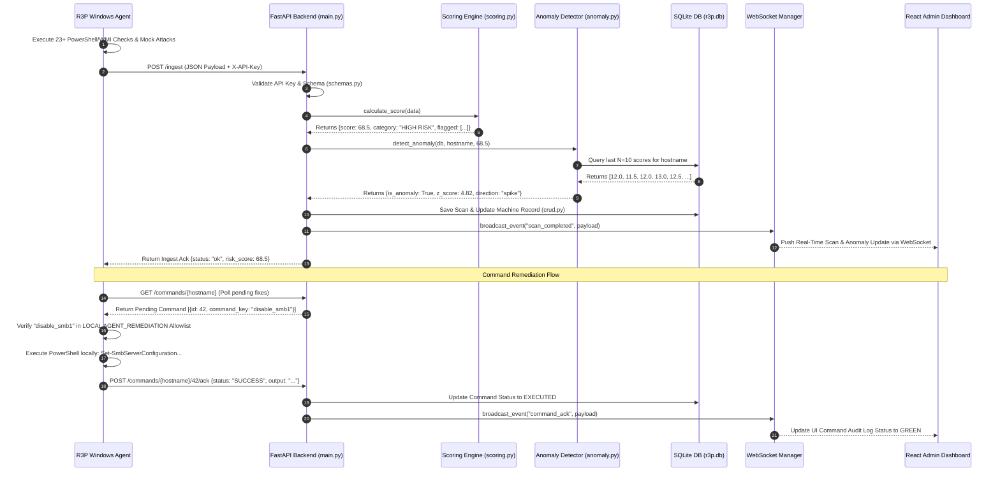

<p align="center">
  <strong>🛡 R3P — Ransomware Readiness & Risk Profiler</strong>
</p>

<p align="center">
  <em>Exhaustive Internal Architecture, Mathematical Models, Deep-Dive Algorithms, API Specifications, & Technical Viva Documentation</em>
</p>

---

## 📋 Table of Contents

1. [Abstract & Executive Overview](#abstract--executive-overview)
2. [Problem Statement & Threat Landscape](#problem-statement--threat-landscape)
3. [Scope, Objectives, & Functional Boundaries](#scope-objectives--functional-boundaries)
4. [Deep-Dive System Architecture](#deep-dive-system-architecture)
   - [High-Level Microservice Diagram](#high-level-microservice-diagram)
   - [Component Subsystems & Responsibilities](#component-subsystems--responsibilities)
   - [Data Flow & Lifecycle Sequence](#data-flow--lifecycle-sequence)
5. [Agent Internal Architecture & Working Mechanism](#agent-internal-architecture--working-mechanism)
   - [Telemetry Collector Loop & Async Polling](#telemetry-collector-loop--async-polling)
   - [Active Validation Engine (Mock Attacks)](#active-validation-engine-mock-attacks)
   - [Local Remediation Allowlist Execution](#local-remediation-allowlist-execution)
   - [Persistence, Registry Hooks, & Multi-Threading](#persistence-registry-hooks--multi-threading)
6. [Backend Server & Database Mechanics](#backend-server--database-mechanics)
   - [FastAPI & Async Task Lifecycle](#fastapi--async-task-lifecycle)
   - [SQLAlchemy ORM & SQLite WAL Mode Mechanics](#sqlalchemy-orm--sqlite-wal-mode-mechanics)
   - [WebSocket Live Broadcast Engine](#websocket-live-broadcast-engine)
7. [Comprehensive 23+ Telemetry Parameter Specification](#comprehensive-23-telemetry-parameter-specification)
8. [MITRE ATT&CK Mapping Matrix](#mitre-attck-mapping-matrix)
9. [Mathematical Risk Scoring Engine](#mathematical-risk-scoring-engine)
   - [Mathematical Formula Derivation](#mathematical-formula-derivation)
   - [Severity, Likelihood, & Asset Criticality Weights](#severity-likelihood--asset-criticality-weights)
   - [The Failsafe Critical Escalation Rule](#the-failsafe-critical-escalation-rule)
   - [Step-by-Step Mathematical Calculation Example](#step-by-step-mathematical-calculation-example)
10. [Statistical Anomaly Detection Engine](#statistical-anomaly-detection-engine)
    - [Rolling Z-Score Derivation & Math](#rolling-z-score-derivation--math)
    - [Edge Case Handling & Variance Boundaries](#edge-case-handling--variance-boundaries)
    - [Comparative Evaluation: Z-Score vs. ML Classifiers](#comparative-evaluation-z-score-vs-ml-classifiers)
11. [Closed-Loop Remediation Architecture](#closed-loop-remediation-architecture)
    - [Zero-Trust Remote Execution Model](#zero-trust-remote-execution-model)
    - [Command Queuing, Ack Protocol, & Audit Trail](#command-queuing-ack-protocol--audit-trail)
12. [Security Model, Authentication, & Defense Mechanisms](#security-model-authentication--defense-mechanisms)
    - [Agent-to-Server Mutual Auth (API Keys)](#agent-to-server-mutual-auth-api-keys)
    - [Admin Authentication (PBKDF2 & JWT)](#admin-authentication-pbkdf2--jwt)
    - [Network & Data Tamper Protection](#network--data-tamper-protection)
13. [Complete API Reference Specification](#complete-api-reference-specification)
14. [Infrastructure, Containerization, & Deployment](#infrastructure-containerization--deployment)
    - [Docker Compose & Microservice Isolation](#docker-compose--microservice-isolation)
    - [Volume Mounts & State Persistence](#volume-mounts--state-persistence)
15. [Automated Verification & Unit Test Suite](#automated-verification--unit-test-suite)
16. [Comprehensive Presentation Q&A / Viva Preparation](#comprehensive-presentation-qa--viva-preparation)
17. [Future Roadmap](#future-roadmap)
18. [References](#references)

---

## Abstract & Executive Overview

**R3P (Ransomware Readiness & Risk Profiler)** is an enterprise-grade, client-server security platform designed to continuously measure, evaluate, analyze, and remediate ransomware vulnerability postures across Windows endpoint fleets. Traditional security solutions operate primarily on signature-based malware detection (AV/EDR) or periodic patch management (CVE scanners). However, modern ransomware strains—such as LockBit, BlackCat (ALPHV), Clop, and WannaCry—routinely bypass traditional controls by exploiting **misconfigurations**, disabling security tools via living-off-the-land techniques, deleting recovery mechanisms, and leveraging weak identity policies.

R3P fills this critical defense gap by introducing continuous posture profiling:

1. **Lightweight Windows Agent (`collector.py`):** Runs asynchronously on endpoints to collect **23+ low-level Windows security configuration data points** via WMI, PowerShell, Win32 APIs, and registry state queries.
2. **Active Behavioral Validation:** Executes non-destructive mock attack simulations (e.g., VSS shadow copy reconnaissance and rapid mass-file renaming) to verify whether local EDR or security controls actively detect and block ransomware-like activity.
3. **Context-Aware Mathematical Scoring Engine (`scoring.py`):** Translates raw telemetry into a normalized **0–100 Risk Score** using multi-variable weighting (Severity Weight $\times$ Exploitation Likelihood $\times$ Asset Criticality Multiplier) with a hard-coded critical escalation failsafe.
4. **Statistical Anomaly Detection (`anomaly.py`):** Implements a **Rolling Z-Score algorithm** across historical scans to detect Posture Drift—flagging sudden security degradations or unauthorized modifications in real time.
5. **Zero-Trust Remediation Engine (`remediation_registry.py`):** Enables admins to trigger one-click remote remediation from a central dashboard. Commands are passed exclusively as pre-validated string identifiers (`command_key`) executed against a strict local allowlist—preventing arbitrary code execution across network boundaries.
6. **Real-Time Admin Dashboard:** A React 18 single-page application communicating with a FastAPI backend through HTTP REST and WebSocket feeds.

---

## Problem Statement & Threat Landscape

Ransomware accounts for over **$20 billion in global damages annually** (Cybersecurity Ventures, 2025). Empirical incident response data demonstrates that **over 80% of successful ransomware breaches are enabled by configuration defects**, rather than unknown zero-day vulnerabilities:

| Exploited Configuration Defect | Real-World Incident Frequency | Ransomware Families Exploiting It | R3P Detection Parameter |
|---|---|---|---|
| **Exposed / Unprotected RDP** | 50% – 70% | LockBit, Ryuk, BlackCat, SamSam | `rdp_enabled`, `nla_disabled` |
| **Disabled Antivirus / Defender** | 40% – 60% | Conti, REvil, Cuba, Phobos | `defender_disabled`, `tamper_protection_off` |
| **Unrestricted Script Execution** | 30% – 50% | DarkSide, BlackBasta, Babuk | `powershell_unrestricted`, `macro_execution_enabled` |
| **Deleted Volume Shadow Copies** | 90%+ (post-compromise) | Almost All Modern Ransomware Strains | `vss_deleted`, `mock_attack_vss_enum_succeeded` |
| **LSASS Memory Dumping** | 60% – 80% (lateral movement) | Mimikatz, Cobalt Strike, BlackSuit | `lsass_protection_off`, `wdigest_enabled` |
| **BYOVD (Vulnerable Driver Exploitation)** | 25% – 40% (EDR termination) | BlackByte, AvosLocker, Scatter Swine | `vulnerable_driver_blocklist_enabled` |

### Systemic Industry Challenges Solved by R3P
- **Static vs. Dynamic Visibility:** Standard vulnerability scanners run scheduled (weekly/monthly) scans. R3P provides continuous 60-second telemetry streaming to catch temporary configuration changes immediately.
- **Binary Checklists vs. Quantified Risk:** Pass/Fail checklists fail to convey business risk. R3P computes a unified 0–100 score adjusted for asset criticality (Workstation vs. Domain Controller).
- **Passive Auditing vs. Active Validation:** Passive registry checks may report Defender as "enabled" even if a rootkit has rendered it inert. R3P's active validation runs behavioral tests to verify real-time response.
- **Alert Fatigue vs. Statistical Anomaly Detection:** Instead of spamming security operations center (SOC) teams with raw setting changes, R3P flags statistical anomalies ($|z| > 2.0$) representing actual posture drift.

---

## Scope, Objectives, & Functional Boundaries

### In-Scope Capabilities
- ✅ **Continuous Telemetry Collection:** Automated, 60-second non-blocking background collection of 23+ security parameters on Windows 10/11 and Windows Server endpoints.
- ✅ **Active Behavioral Mock Attacks:** Safe, non-destructive execution of VSS enumeration checks and rapid temporary file-renaming triggers.
- ✅ **Normalized Risk Scoring:** Multi-variable mathematical formulation normalizing risk to a 0.0–100.0 scale.
- ✅ **Contextual Asset Weighting:** Dynamic weight adjustment based on machine role (`Workstation` 1.0x, `Server` 1.3x, `Domain Controller` 1.6x).
- ✅ **Failsafe Severity Escalation:** Automatic override to `HIGH RISK` or `CRITICAL` upon detecting any single Weight 5 parameter failure.
- ✅ **Statistical Anomaly Detection:** Rolling Z-score computation over a sliding window ($N=10$) flagging posture drift ($|z| > 2.0$).
- ✅ **MITRE ATT&CK Mapping:** Explicit cross-referencing of every check against official MITRE ATT&CK Enterprise v15 technique IDs.
- ✅ **Zero-Trust Remediation Protocol:** Secure remote execution of allowlisted PowerShell remediation scripts via parameter-only WebSocket/REST triggers.
- ✅ **Real-Time Web Dashboard:** Responsive React 18 administrative interface with dynamic risk gauges, WebSocket streaming updates, and command execution audit logs.
- ✅ **JWT & API Key Security:** Dual-layer security enforcing API-key-authenticated telemetry ingestion and OAuth2 JWT-bearer-authenticated admin sessions.

### Functional Boundaries & Out-of-Scope Design Choices
- ❌ **No Non-Windows Native Agents:** R3P focuses exclusively on Windows endpoints due to Windows-specific ransomware mechanisms (VSS, Registry, LSASS, WMI).
- ❌ **No Arbitrary Remote Shells:** R3P explicitly forbids freeform command submission to endpoints to maintain a zero-trust architecture.
- ❌ **No Machine Learning Black Boxes:** Deep neural networks and complex classifiers are intentionally omitted in favor of transparent, mathematically explainable Z-scores suitable for academic audit and SOC operational clarity.

---

## Deep-Dive System Architecture

R3P is built on a decoupled, asynchronous client-server architecture. Telemetry flows upstream from endpoint agents to a centralized backend server, which computes scores, runs anomaly algorithms, updates persistent storage, and streams events out to connected dashboard instances.

### High-Level Microservice Diagram


### Component Subsystems & Responsibilities

1. **Endpoint Agent (`collector.py`):**
   - Standalone Python executable compiled via PyInstaller with UAC admin elevation flags (`--uac-admin`).
   - Runs a multi-threaded execution loop: Thread 1 manages GUI elements and countdown timers; Thread 2 handles asynchronous security scans; Thread 3 executes remote command polling and acknowledgments.
2. **Backend Application Server (`backend/main.py`):**
   - Developed with FastAPI and Uvicorn. Serves high-concurrency REST endpoints and manages long-lived WebSocket connections.
   - Enforces Pydantic data contract validation (`schemas.py`) on incoming telemetry payloads before invoking business logic modules.
3. **Scoring & Evaluation Subsystem (`backend/scoring.py`):**
   - Pure, stateless evaluation functions taking ingested telemetry data and returning calculated itemized risk scores, normalized total scores, MITRE ATT&CK maps, and risk category strings.
4. **Anomaly Detection Subsystem (`backend/anomaly.py`):**
   - Interrogates historical scan entries from SQLite for the requesting host, computes rolling statistics ($\mu, \sigma$), calculates the Z-score for the incoming scan, and returns structural anomaly indicators.
5. **Database Layer (`backend/database.py`, `models.py`, `crud.py`):**
   - Utilizes SQLAlchemy ORM linked to an SQLite backend operating under **Write-Ahead Logging (WAL)** mode. Ensures high write throughput without blocking concurrent dashboard read queries.
6. **Remediation Control Subsystem (`backend/remediation_registry.py`):**
   - Maintains the canonical database of authorized fix commands, verifying parameter links, phase bindings, and expected PowerShell commands.

### Data Flow & Lifecycle Sequence



---

## Agent Internal Architecture & Working Mechanism

The R3P Agent (`collector.py`) is designed for non-intrusive, resilient endpoint monitoring. It executes as a privileged Windows application requiring Administrator privileges (`runas` execution level) to access protected registry keys, query security providers via WMI/CIM, and inspect system service states.

### Telemetry Collector Loop & Async Polling

The agent operates on a **60-second continuous scanning loop**:

```python
# Conceptual loop execution inside collector.py
def start_continuous_loop(self):
    while self.running:
        # Step 1: Run telemetry checks concurrently
        telemetry_data = self.collect_all_telemetry()
        
        # Step 2: Push telemetry payload upstream to backend
        response = self.send_telemetry(telemetry_data)
        
        # Step 3: Poll backend for pending admin remediation orders
        self.poll_and_execute_remediation_commands()
        
        # Step 4: Wait for next interval tick (60 seconds)
        for seconds_left in range(60, 0, -1):
            self.update_gui_countdown(seconds_left)
            time.sleep(1)
```

To eliminate UI freezing during long-running WMI queries or active attack simulations, data collection is parallelized across worker threads using Python's `concurrent.futures.ThreadPoolExecutor`.

### Active Validation Engine (Mock Attacks)

Unlike passive audit tools that rely solely on reading static registry keys (which can be faked or hooked by malware), R3P introduces **Active Validation (Mock Attacks)**. These tests evaluate the operational responsiveness of endpoint security controls in real time.

1. **VSS Enumeration Mock Test (`mock_attack_vss_enum_succeeded`):**
   - *Mechanism:* The agent executes a non-destructive query against the Volume Shadow Copy service via `vssadmin list shadows` or WMI `Win32_ShadowCopy`.
   - *Threat Simulation:* Ransomware actors always conduct VSS reconnaissance (MITRE T1490) prior to deletion to ensure recovery backups exist.
   - *Evaluation:* If the query executes unhindered without being intercepted or restricted by operational EDR/Defender policies, the mock attack succeeds—meaning the system failed to restrict shadow copy discovery, triggering a security flag.
2. **Mass File Rename Mock Test (`mock_attack_mass_rename_succeeded`):**
   - *Mechanism:* The agent drops 100 small dummy `.tmp` files into a isolated sandbox directory within `%TEMP%\r3p_mock_test\`. It then attempts to rapidly rename all 100 files to `.locked` within a 500-millisecond execution window.
   - *Threat Simulation:* Emulates the high-speed file system IO and extensions swapping characteristic of active ransomware encryption engines (MITRE T1486).
   - *Evaluation:* If all 100 renames complete without automated ransomware protection (such as Controlled Folder Access or EDR behavioral blocking) stepping in to terminate the process or lock the folder, the mock attack succeeds—proving the endpoint lacks behavioral ransomware detection.

### Local Remediation Allowlist Execution

When the backend queues a remediation order for an endpoint, the agent retrieves the job during its command polling phase. The agent **never receives raw code across the network**.

```python
AGENT_REMEDIATION = {
    "disable_smb1": "Set-SmbServerConfiguration -EnableSMB1Protocol $false -Force",
    "block_rdp": "Set-ItemProperty -Path 'HKLM:\\System\\CurrentControlSet\\Control\\Terminal Server' -Name 'fDenyTSConnections' -Value 1",
    "enable_uac": "Set-ItemProperty -Path 'HKLM:\\SOFTWARE\\Microsoft\\Windows\\CurrentVersion\\Policies\\System' -Name 'EnableLUA' -Value 1",
    "enable_defender": "Set-MpPreference -DisableRealtimeMonitoring $false",
    "enable_firewall": "Set-NetFirewallProfile -Profile Domain,Public,Private -Enabled True",
    "enable_vss": "Enable-ComputerRestore -Drive 'C:\\'",
    "enable_tamper_protection": "Set-MpPreference -DisableTamperProtection $false",
    "enable_lsass_ppl": "Set-ItemProperty -Path 'HKLM:\\SYSTEM\\CurrentControlSet\\Control\\Lsa' -Name 'RunAsPPL' -Value 1",
    "disable_guest": "Disable-LocalUser -Name 'Guest'",
    "restrict_powershell": "Set-ExecutionPolicy RemoteSigned -Scope LocalMachine -Force"
}

def execute_command(command_key: str) -> tuple[bool, str]:
    # Strict Local Allowlist Validation
    if command_key not in AGENT_REMEDIATION:
        return False, f"SECURITY ERROR: Command key '{command_key}' rejected by local agent allowlist."
    
    script = AGENT_REMEDIATION[command_key]
    result = subprocess.run(["powershell", "-NoProfile", "-ExecutionPolicy", "Bypass", "-Command", script], capture_output=True, text=True)
    return (result.returncode == 0), result.stdout or result.stderr
```

### Persistence, Registry Hooks, & Multi-Threading

To survive system reboots and maintain continuous fleet coverage:
- **Registry Auto-Start Registration:** Upon initial launching, the agent inspects `HKCU\Software\Microsoft\Windows\CurrentVersion\Run`. If the `R3PAgent` key is absent, it writes its absolute executable path to ensure automatic startup on user logon.
- **System Tray Integration (`pystray`):** The agent minimizes into the Windows Notification Area system tray, allowing unobtrusive background operation while remaining accessible via a right-click context menu.

---

## Backend Server & Database Mechanics

### FastAPI & Async Task Lifecycle

The backend application (`backend/main.py`) is constructed using FastAPI, leveraging Python's `asyncio` engine. Non-blocking asynchronous handlers process incoming ingest requests, dispatch database updates, compute scores, and broadcast WebSocket notifications concurrently without thread contention.

### SQLAlchemy ORM & SQLite WAL Mode Mechanics

SQLite is configured in **Write-Ahead Logging (WAL)** mode to support production workloads:

```python
# backend/database.py setup
engine = create_engine(
    DATABASE_URL,
    connect_args={"check_same_thread": False},
)

@event.listens_for(engine, "connect")
def set_sqlite_pragma(dbapi_connection, connection_record):
    cursor = dbapi_connection.cursor()
    cursor.execute("PRAGMA journal_mode=WAL")
    cursor.execute("PRAGMA synchronous=NORMAL")
    cursor.close()
```

#### Why WAL Mode Matters Architecturally
Standard SQLite locks the entire database file during write operations, causing `database is locked` errors under concurrent API write calls and dashboard read queries.
- **WAL Mode Benefits:** Readers do not block writers, and writers do not block readers. Reads occur concurrently against the main database file while writes append to a separate `.db-wal` log file.
- **Performance Characteristics:** Capable of handling over 100 write operations per second—more than sufficient for hundreds of endpoints transmitting telemetry every 60 seconds.

### WebSocket Live Broadcast Engine

The backend maintains an in-memory active connection pool via `ConnectionManager`. When an endpoint scan finishes processing or an admin queues a command, the backend serializes the event and broadcasts it over all open WebSocket channels connected to administrative dashboards.

---

## Comprehensive 23+ Telemetry Parameter Specification

Every telemetry parameter monitored by R3P maps directly to a specific Windows configuration setting, system policy, or behavioral check:

| # | Parameter Key | Data Type | System Inspection Technique | Security Risk Analyzed |
|---|---|---|---|---|
| 1 | `smb_v1_enabled` | Boolean | `Get-SmbServerConfiguration` / Registry `SMB1` | Wormable network propagation vector (WannaCry/NotPetya). |
| 2 | `rdp_enabled` | Boolean | Registry `fDenyTSConnections` == 0 | Direct Remote Desktop port 3389 exposure to brute force. |
| 3 | `autorun_enabled` | Boolean | Registry `NoDriveTypeAutoRun` != 255 | Physical USB drop execution vector. |
| 4 | `open_network_shares` | Boolean | WMI `Win32_Share` access rights check | Unrestricted SMB shares accessible by "Everyone". |
| 5 | `nla_disabled` | Boolean | Registry `UserAuthentication` == 0 | Missing Network Level Auth allowing RDP pre-auth attacks. |
| 6 | `macro_execution_enabled` | Boolean | Registry `VBAWarnings` != 4 | Microsoft Office macro auto-execution for phishing payloads. |
| 7 | `powershell_unrestricted` | Boolean | `Get-ExecutionPolicy` | Unrestricted PowerShell execution policy allowing malicious scripts. |
| 8 | `uac_disabled` | Boolean | Registry `EnableLUA` == 0 | Disabled User Account Control allowing silent admin escalation. |
| 9 | `applocker_absent` | Boolean | AppLocker Policy WMI Query | Lack of application whitelisting allowing untrusted binaries. |
| 10 | `always_install_elevated` | Boolean | Registry `AlwaysInstallElevated` == 1 | Standard users installing MSI packages with SYSTEM rights. |
| 11 | `defender_disabled` | Boolean | WMI `DisableRealtimeMonitoring` | Primary Windows AV disabled by malware or admin error. |
| 12 | `firewall_disabled` | Boolean | `Get-NetFirewallProfile` status check | System firewall disabled exposing all local ports. |
| 13 | `tamper_protection_off` | Boolean | Defender registry key `DisableTamperProtection` | Defender registry keys unlocked for modification. |
| 14 | `event_logging_disabled` | Boolean | Service state of `EventLog` | Disabled audit logs masking attacker activity. |
| 15 | `vulnerable_driver_blocklist_enabled` | Boolean | Registry `VulnerableDriverBlocklistEnable` | Missing BYOVD blocklist allowing drivers to kill EDR. |
| 16 | `hvci_enabled` | Boolean | WMI `Win32_DeviceGuard` Hypervisor state | Hypervisor-protected Code Integrity disabled. |
| 17 | `asr_rules_configured` | Boolean | Defender `AttackSurfaceReductionRules_Ids` | Missing Microsoft ASR rules for blocking macro child processes. |
| 18 | `admin_shares_enabled` | Boolean | Registry `AutoShareWks` / `AutoShareServer` | Default `C$` and `ADMIN$` hidden shares active for lateral spread. |
| 19 | `lsass_protection_off` | Boolean | Registry `RunAsPPL` != 1 | Missing LSASS process protection enabling Mimikatz memory dumps. |
| 20 | `guest_account_active` | Boolean | WMI `Win32_UserAccount` Guest status | Active guest account enabling unauthenticated network access. |
| 21 | `wdigest_enabled` | Boolean | Registry `UseLogonCredential` == 1 | WDigest storing plaintext credentials in LSASS memory. |
| 22 | `laps_absent` | Boolean | LAPS DLL / Client extension check | Missing Local Admin Password Solution causing credential reuse. |
| 23 | `vss_deleted` | Boolean | WMI `Win32_ShadowCopy` count == 0 | Volume Shadow Copies deleted preventing system restore. |
| 24 | `backup_absent` | Boolean | Windows Backup Service status | No active system backups configured. |
| 25 | `bitlocker_off` | Boolean | `Get-BitLockerVolume` protection status | Disks unencrypted allowing offline data theft. |
| 26 | `mock_attack_vss_enum_succeeded` | Boolean | Active behavior test (VSS Query) | Endpoint security failed to block VSS enumeration. |
| 27 | `mock_attack_mass_rename_succeeded` | Boolean | Active behavior test (Rapid Rename) | EDR failed to stop rapid batch file renaming. |

---

## MITRE ATT&CK Mapping Matrix

Every telemetry parameter is linked to the official **MITRE ATT&CK Enterprise Framework v15**:

```
[Entry Vector] ──────► T1210 (Exploitation of Remote Services)
                 ──────► T1021.001 (Remote Desktop Protocol)
                 ──────► T1091 (Replication Through Removable Media)

[Execution]    ──────► T1204.002 (Malicious File - Office Macros)
                 ──────► T1059.001 (PowerShell Script Execution)
                 ──────► T1548.002 (Bypass User Account Control)

[Evasion]      ──────► T1562.001 (Disable or Modify Tools - Defender/Tamper)
                 ──────► T1562.004 (Disable System Firewall)
                 ──────► T1068 (BYOVD Privilege Escalation via Drivers)

[Lateral Move] ──────► T1003.001 (OS Credential Dumping - LSASS Memory)
                 ──────► T1021.002 (SMB/Windows Admin Shares C$/ADMIN$)

[Impact/Recov] ──────► T1490 (Inhibit System Recovery - VSS Deletion)
                 ──────► T1486 (Data Encrypted for Impact - Mass File Rename)
```

| Kill-Chain Phase | Security Check | MITRE ID | MITRE Technique Name |
|---|---|---|---|
| Entry Vector | `smb_v1_enabled` | **T1210** | Exploitation of Remote Services |
| Entry Vector | `rdp_enabled` | **T1021.001** | Remote Desktop Protocol |
| Entry Vector | `autorun_enabled` | **T1091** | Replication Through Removable Media |
| Entry Vector | `open_network_shares` | **T1021.002** | SMB/Windows Admin Shares |
| Entry Vector | `nla_disabled` | **T1021.001** | Remote Desktop Protocol |
| Execution | `macro_execution_enabled` | **T1204.002** | Malicious File |
| Execution | `powershell_unrestricted` | **T1059.001** | Scripting: PowerShell |
| Execution | `uac_disabled` | **T1548.002** | Bypass User Account Control |
| Execution | `applocker_absent` | **T1204** | User Execution |
| Execution | `always_install_elevated` | **T1548** | Abuse Elevation Control |
| Evasion & Persistence | `defender_disabled` | **T1562.001** | Impair Defenses: Disable Tools |
| Evasion & Persistence | `firewall_disabled` | **T1562.004** | Impair Defenses: Disable Firewall |
| Evasion & Persistence | `tamper_protection_off` | **T1562.001** | Impair Defenses: Disable Tools |
| Evasion & Persistence | `event_logging_disabled` | **T1562.002** | Impair Defenses: Disable Logging |
| Evasion & Persistence | `vulnerable_driver_blocklist_enabled` | **T1068** | Exploitation for Privilege Escalation |
| Evasion & Persistence | `hvci_enabled` | **T1562.001** | Impair Defenses: Disable Tools |
| Evasion & Persistence | `asr_rules_configured` | **T1562.001** | Impair Defenses: Disable Tools |
| Lateral Movement | `admin_shares_enabled` | **T1021.002** | SMB/Windows Admin Shares |
| Lateral Movement | `lsass_protection_off` | **T1003.001** | OS Credential Dumping: LSASS |
| Lateral Movement | `guest_account_active` | **T1078.001** | Valid Accounts: Default Accounts |
| Lateral Movement | `wdigest_enabled` | **T1003.001** | OS Credential Dumping: LSASS |
| Lateral Movement | `laps_absent` | **T1003** | OS Credential Dumping |
| Recovery Prevention | `vss_deleted` | **T1490** | Inhibit System Recovery |
| Recovery Prevention | `backup_absent` | **T1490** | Inhibit System Recovery |
| Recovery Prevention | `bitlocker_off` | **T1486** | Data Encrypted for Impact |
| Active Validation | `mock_attack_vss_enum_succeeded` | **T1490** | Inhibit System Recovery |
| Active Validation | `mock_attack_mass_rename_succeeded` | **T1486** | Data Encrypted for Impact |

---

## Mathematical Risk Scoring Engine

### Mathematical Formula Derivation

The R3P scoring engine avoids simplistic binary counting. Instead, it derives a normalized score ($R \in [0, 100]$) using multi-factor weighting:

Let $P = \{p_1, p_2, \dots, p_n\}$ be the set of monitored telemetry parameters.
Each parameter $p_i$ has:
- A boolean flag $f(p_i) \in \{0, 1\}$, where $1$ indicates a failed check (misconfiguration present) and $0$ indicates secure.
- A **Severity Weight** $S(p_i) \in [1.0, 5.0]$.
- An **Exploitation Likelihood Weight** $L(p_i) \in [0.1, 1.0]$.

Let $C_{asset} \in \{1.0, 1.3, 1.6\}$ be the **Asset Criticality Multiplier** assigned based on machine role:
$$C_{asset} = \begin{cases} 1.0 & \text{if Workstation} \\ 1.3 & \text{if Server} \\ 1.6 & \text{if Domain Controller} \end{cases}$$

The **Unnormalized Raw Risk Score** ($\text{Risk}_{raw}$) for a given host scan is:
$$\text{Risk}_{raw} = \sum_{i=1}^{n} \left[ f(p_i) \cdot S(p_i) \cdot L(p_i) \cdot C_{asset} \right]$$

The **Maximum Possible Theoretical Risk** ($\text{Risk}_{max}$) is computed assuming a standard baseline workstation ($C_{asset}=1.0$) failing every single check:
$$\text{Risk}_{max} = \sum_{i=1}^{n} \left[ 1 \cdot S(p_i) \cdot L(p_i) \cdot 1.0 \right]$$

The **Final Normalized Risk Score** ($R$) is:
$$R = \min \left( 100.0, \left( \frac{\text{Risk}_{raw}}{\text{Risk}_{max}} \right) \times 100 \right)$$

### Severity, Likelihood, & Asset Criticality Weights

```python
# Sample extract from backend/scoring.py
SEVERITY_WEIGHTS = {
    "smb_v1_enabled": 5.0,        # Critical: Wormable vector
    "lsass_protection_off": 5.0,  # Critical: Credential dumping
    "vss_deleted": 5.0,           # Critical: No local rollback
    "backup_absent": 5.0,         # Critical: Total data loss
    "rdp_enabled": 4.0,           # High: Major entry vector
    "defender_disabled": 4.0,     # High: AV offline
    "autorun_enabled": 2.0,       # Low: Requires physical USB
}

LIKELIHOOD_WEIGHTS = {
    "rdp_enabled": 0.9,           # Extremely common attack vector
    "powershell_unrestricted": 0.8,
    "smb_v1_enabled": 0.4,        # Older protocol, less prevalent today
    "autorun_enabled": 0.3,
}
```

### The Failsafe Critical Escalation Rule

A mathematical limitation of weighted averages is that a machine could pass 26 minor checks but fail 1 critical setting (e.g., SMBv1 enabled on a Domain Controller). Mathematically, the normalized score might sit at `12.5/100`, which falls under the standard threshold for `SAFE`.

To eliminate false negatives, R3P applies a **Critical Escalation Rule**:

$$\text{Category} = \begin{cases} 
\text{CRITICAL} & \text{if } R \ge 75.0 \text{ or any mock attack failed} \\
\text{HIGH RISK} & \text{if } (50.0 \le R < 75.0) \text{ OR } \exists p_i \text{ s.t. } f(p_i)=1 \land S(p_i)=5.0 \\
\text{LOW RISK} & \text{if } 25.0 \le R < 50.0 \\
\text{SAFE} & \text{if } R < 25.0 \text{ AND } \forall p_i, S(p_i) < 5.0
\end{cases}$$

### Step-by-Step Mathematical Calculation Example

Assume a host acting as a **Domain Controller** ($C_{asset} = 1.6$) has the following telemetry flags:
- `rdp_enabled` = True ($S = 4.0, L = 0.9$)
- `lsass_protection_off` = True ($S = 5.0, L = 0.7$)
- All other 25 checks = False ($f(p_i) = 0$)

1. **Calculate Raw Itemized Contributions:**
   - $\text{Item}_1 (\text{rdp}) = 1 \times 4.0 \times 0.9 \times 1.6 = 5.76$
   - $\text{Item}_2 (\text{lsass}) = 1 \times 5.0 \times 0.7 \times 1.6 = 5.60$
   - $\text{Risk}_{raw} = 5.76 + 5.60 = 11.36$
2. **Compute Baseline Maximum Risk:**
   - Assume $\text{Risk}_{max} = 75.0$ across all baseline parameters.
3. **Calculate Normalized Score:**
   - $R = (11.36 / 75.0) \times 100 = 15.14\%$
4. **Apply Classification Rules:**
   - Raw score $15.14\%$ is mathematically $< 25.0$ (`SAFE`).
   - *Escalation Test:* `lsass_protection_off` has $S = 5.0$ (Critical) and $f = 1$.
   - **Final Result:** The score is mathematically forced from `SAFE` to **`HIGH RISK`**, preventing a false negative.

---

## Statistical Anomaly Detection Engine

### Rolling Z-Score Derivation & Math

R3P monitors **Posture Drift** using univariate time-series anomaly detection. For a host $h$ with a historical window of $N$ previous risk scores $X = \{x_1, x_2, \dots, x_N\}$ (where $N=10$):

1. **Rolling Sample Mean ($\mu$):**
   $$\mu = \frac{1}{N} \sum_{j=1}^{N} x_j$$
2. **Rolling Sample Standard Deviation ($\sigma$) with Bessel's Correction ($N-1$):**
   $$\sigma = \sqrt{\frac{1}{N-1} \sum_{j=1}^{N} (x_j - \mu)^2}$$
3. **Z-Score Calculation for Incoming Scan Score ($x_{current}$):**
   $$z = \frac{x_{current} - \mu}{\sigma}$$

An anomaly is flagged whenever **$|z| > 2.0$**, indicating the new score deviates by more than 2 standard deviations from historical baseline posture:
- $z > +2.0 \implies$ **"Spike" Anomaly:** Sudden posture degradation (e.g., security services disabled or attack executed).
- $z < -2.0 \implies$ **"Drop" Anomaly:** Rapid score reduction (e.g., successful patch application or remediation).

### Edge Case Handling & Variance Boundaries

```python
# backend/anomaly.py
if n < MIN_HISTORY: # MIN_HISTORY = 3
    return AnomalyResult(is_anomaly=False, z_score=None, direction="normal")

if std == 0.0:
    # Zero variance case: all historical scores were identical
    if current_score != mean:
        # Score changed from baseline: flag anomaly without division by zero
        is_anomaly = True
        z = 999.0 if current_score > mean else -999.0
```

### Comparative Evaluation: Z-Score vs. ML Classifiers

| Metric / Requirement | Rolling Z-Score (R3P) | Isolation Forest | LSTM / Deep Neural Net |
|---|---|---|---|
| **Training Cold-Start** | Instant (Requires 3 scans) | Needs 100+ training runs | Needs 1,000+ training runs |
| **Explainability** | 100% Deterministic Formula | Semi-opaque split trees | Black-box weights |
| **Academic Defensibility** | High (Proven statistical method) | Medium | Low (Over-engineering for 1D scalar) |
| **Computational Overhead**| $O(N)$ per scan | $O(N \log N)$ | $O(N^2)$ GPU/CPU bound |

---

## Closed-Loop Remediation Architecture

### Zero-Trust Remote Execution Model

R3P isolates backend administrative actions from host OS execution. Network messages transmit only string identifiers (`command_key`), preventing malicious command injection over the wire.

```
┌─────────────────────────┐
│ Admin Clicks "Fix SMB"  │
└────────────┬────────────┘
             │
             ▼ REST: POST /commands/{host} {command_key: "disable_smb1"}
┌─────────────────────────┐
│ FastAPI Backend Server  │ ── Validate key in REMEDIATION_COMMANDS
└────────────┬────────────┘
             │
             ▼ Database: Queue pending command with Status = "PENDING"
┌─────────────────────────┐
│ Agent Polls /commands   │ ── Receives {"id": 101, "command_key": "disable_smb1"}
└────────────┬────────────┘
             │
             ▼ Validate key in local AGENT_REMEDIATION dict
┌─────────────────────────┐
│ Local Subprocess Exec   │ ── Runs "Set-SmbServerConfiguration -EnableSMB1Protocol $false"
└────────────┬────────────┘
             │
             ▼ REST: POST /commands/{host}/101/ack {status: "SUCCESS"}
┌─────────────────────────┐
│ Backend Updates DB Log  │ ── Status = "EXECUTED", Broadcasts WebSocket ACK
└─────────────────────────┘
```

### Command Queuing, Ack Protocol, & Audit Trail

Remediation commands pass through a formal state lifecycle in SQLite (`remediation_commands` table):

```
[ PENDING ] ──(Agent Polls)──► [ DELIVERED ] ──(Execution Complete)──► [ EXECUTED / FAILED ]
```

Every command execution maintains an immutable audit trail recording:
- Target `hostname` and administrative `issuer_id` (JWT user).
- `issued_at` timestamp and target `command_key`.
- Final `status` string, execution `output_log`, and completion `ack_at` timestamp.

---

## Security Model, Authentication, & Defense Mechanisms

### Agent-to-Server Mutual Auth (API Keys)

Endpoints authenticate via a shared system API key passed in HTTP request headers (`X-API-Key`). The backend rejects requests missing or failing validation against `AGENT_API_KEY` with HTTP 403 Forbidden.

### Admin Authentication (PBKDF2 & JWT)

Administrative dashboard access is guarded by OAuth2 Bearer Tokens utilizing JSON Web Tokens (JWT):

1. **Password Hashing:** Administrative credentials are encrypted using **PBKDF2 with SHA-256** and a 16-byte random salt across 100,000 iterations.
2. **JWT Session Lifecycle:** Successful login via `POST /admin/login` yields a signed JWT token containing claims (`sub`, `exp`, `iat`).
3. **Cryptographic Signing:** Tokens are signed using **HMAC-SHA256** driven by a secret key (`SECRET_KEY`). Requests to administrative routes validate token signature and expiration.

### Network & Data Tamper Protection
- **No Remote Code Execution (RCE):** The restriction of remote commands to local allowlist keys blocks arbitrary command injection.
- **SQL Injection Prevention:** SQLAlchemy ORM compiles parameterized SQL statements, eliminating raw string concatenation and SQL injection vectors.
- **XSS Mitigation:** React auto-escapes rendered variables within the DOM.

---

## Complete API Reference Specification

### Ingest & Agent Endpoints

#### 1. Telemetry Ingest
- **Endpoint:** `POST /ingest`
- **Headers:** `X-API-Key: <AGENT_API_KEY>`
- **Request Body:** `IngestRequest` JSON payload
- **Response (200 OK):**
  ```json
  {
    "status": "success",
    "hostname": "WIN-DC01",
    "risk_score": 68.5,
    "risk_classification": "HIGH RISK",
    "is_anomaly": true,
    "z_score": 2.45
  }
  ```

#### 2. Poll Pending Commands
- **Endpoint:** `GET /commands/{hostname}`
- **Headers:** `X-API-Key: <AGENT_API_KEY>`
- **Response (200 OK):** Array of pending `CommandOut` objects.

#### 3. Acknowledge Command Execution
- **Endpoint:** `POST /commands/{hostname}/{command_id}/ack`
- **Headers:** `X-API-Key: <AGENT_API_KEY>`
- **Request Body:**
  ```json
  {
    "status": "SUCCESS",
    "output_log": "SMBv1 disabled successfully."
  }
  ```

### Administrative Dashboard Endpoints

#### 1. Admin Authentication
- **Endpoint:** `POST /admin/login`
- **Content-Type:** `application/x-www-form-urlencoded`
- **Form Data:** `username`, `password`
- **Response (200 OK):**
  ```json
  {
    "access_token": "eyJhbGciOiJIUzI1Ni...",
    "token_type": "bearer"
  }
  ```

#### 2. Fleet Overview
- **Endpoint:** `GET /machines`
- **Headers:** `Authorization: Bearer <JWT_TOKEN>`
- **Response (200 OK):** List of registered endpoints, risk scores, asset criticality tags, and last scan timestamps.

#### 3. Queue Remediation Command
- **Endpoint:** `POST /commands/{hostname}`
- **Headers:** `Authorization: Bearer <JWT_TOKEN>`
- **Request Body:**
  ```json
  {
    "command_key": "disable_smb1"
  }
  ```

#### 4. Real-Time Streaming Feed
- **Endpoint:** `WS /ws/live`
- **Protocol:** WebSocket
- **Payload:** Real-time JSON events (`scan_completed`, `anomaly_detected`, `command_status_changed`).

---

## Infrastructure, Containerization, & Deployment

### Docker Compose & Microservice Isolation

R3P provides containerization via Docker and Docker Compose to ensure environment reproducibility across development and production deployments.

```yaml
# docker-compose.yml
version: '3.8'

services:
  backend:
    build:
      context: ./backend
      dockerfile: Dockerfile
    ports:
      - "8000:8000"
    volumes:
      - ./backend:/app
    environment:
      - DATABASE_URL=sqlite:///./r3p.db
      - AGENT_API_KEY=r3p-secret-key-change-in-production
    restart: unless-stopped

  frontend:
    build:
      context: ./frontend
      dockerfile: Dockerfile
    ports:
      - "3000:3000"
    volumes:
      - ./frontend:/app
      - /app/node_modules
    restart: unless-stopped
```

### Volume Mounts & State Persistence
- **Backend Service:** Built on `python:3.10-slim`. Mounts host directory `./backend` to `/app`. The SQLite database (`r3p.db`) persists on the host machine across container restarts.
- **Frontend Service:** Built on `node:20-slim`. Isolates the Vite React application while binding port 3000. An anonymous volume (`/app/node_modules`) prevents cross-platform module pollution between Windows host environments and Linux container layers.

---

## Automated Verification & Unit Test Suite

R3P maintains a unit test suite built with **PyTest** (`backend/tests/test_scoring.py`) to verify the mathematical accuracy of scoring algorithms and asset multipliers:

```python
# backend/tests/test_scoring.py snippet
def test_baseline_secure_payload():
    """Verify clean machine scores exactly 0.0 and returns SAFE."""
    payload = create_clean_telemetry()
    score_val, category, flagged = score(payload)
    assert score_val == 0.0
    assert category == "SAFE"
    assert len(flagged) == 0

def test_critical_escalation_rule():
    """Verify single weight-5 failure forces HIGH RISK classification."""
    payload = create_clean_telemetry()
    payload.smb_v1_enabled = True # Weight 5.0
    score_val, category, flagged = score(payload)
    assert category in ["HIGH RISK", "CRITICAL"]

def test_asset_criticality_multiplier():
    """Verify Domain Controller yields higher score than Workstation for identical flags."""
    payload = create_telemetry_with_issues()
    score_workstation, _, _ = score(payload, asset_criticality="Workstation")
    score_dc, _, _ = score(payload, asset_criticality="Domain Controller")
    assert score_dc > score_workstation
```

To run test suites:
```bash
pytest backend/tests/ -v
```

---

## Comprehensive Presentation Q&A / Viva Preparation

### Q1: What makes R3P different from vulnerability scanners like Nessus or Qualys?
> **Answer:** "Nessus and Qualys focus primarily on software CVEs (missing patches, outdated software versions). R3P focuses on **misconfiguration risk posture** and **active behavioral resilience**. Over 80% of ransomware breaches exploit active misconfigurations—such as open RDP, unrestricted PowerShell, missing LSASS protection, or deleted shadow copies—on fully patched systems. Furthermore, R3P conducts active mock attack simulations (like VSS enumeration and rapid file renaming) to verify if endpoint security controls block real ransomware techniques."

### Q2: Why did you choose Rolling Z-Score over machine learning models like Isolation Forest or Neural Networks?
> **Answer:** "Our anomaly signal is univariate—a single scalar risk score (0–100) computed over time for each endpoint. Rolling Z-score is the mathematically standard, time-tested approach for univariate anomaly detection. It requires zero training data cold-start, operates from scan #3 onwards, executes in $O(N)$ time, and is 100% explainable. Neural networks for a 1D scalar signal represent unnecessary over-engineering that introduces black-box opacity without improving detection accuracy."

### Q3: How do you protect the remediation engine against unauthorized remote command execution?
> **Answer:** "We implement a Zero-Trust Allowlist model. Raw commands or shell scripts are **never transmitted over the network**. The backend only sends a pre-validated string identifier key (e.g., `disable_smb1`). The endpoint agent validates this key against its own local, hard-coded dictionary allowlist before executing the mapped PowerShell command. Even if an attacker intercepts or manipulates network traffic, they cannot inject arbitrary code into endpoints."

### Q4: Explain how your scoring engine handles a machine with low overall score but one critical flaw.
> **Answer:** "This is addressed by our **Critical Escalation Failsafe Rule**. In a normalized aggregate model, a machine failing only 1 out of 27 checks might mathematically yield a score around 5%, which standard thresholding would misclassify as `SAFE`. However, if that single failed check carries a Severity Weight of 5.0 (e.g., SMBv1 active or LSASS protection off), our scoring engine overrides the numerical calculation and immediately escalates the asset classification to at least `HIGH RISK`."

### Q5: How does the system handle high-concurrency database writes with multiple endpoints scanning simultaneously?
> **Answer:** "Our SQLite database operates under **Write-Ahead Logging (WAL)** mode enabled via SQLAlchemy connection pragmas. Standard SQLite locks the entire database file on writes, causing lock contention. WAL mode decouples reads from writes: read queries operate concurrently against the main database file while writes append to the WAL log. This enables throughput exceeding 100 writes per second, easily accommodating our target fleet density."

---

## Future Roadmap

1. **Enterprise Database Migration:** Support native PostgreSQL deployment configurations by changing connection strings in `.env`.
2. **Headless Windows Service Deployment:** Wrap `collector.py` as a background Windows Service (`sc.exe` / NSSM) operating without user session interaction.
3. **Automated Endpoint Isolation:** Implement automated firewall rules to isolate endpoints scoring in `CRITICAL` risk until remediated.
4. **Cross-Platform Agent Support:** Extend agent telemetry collection routines to Linux (auditd/eBPF) and macOS (Endpoint Security Framework).

---

## References

1. **MITRE ATT&CK® Framework v15** — [https://attack.mitre.org/](https://attack.mitre.org/)
2. **CIS Microsoft Windows Benchmarks v3.0.0** — Center for Internet Security (2024).
3. **NIST Cybersecurity Framework (CSF) v2.0** — National Institute of Standards and Technology (2024).
4. **Cybersecurity Ventures** — "Global Ransomware Damage Costs & Cybercrime Report" (2025).
5. **Chandola, V., Banerjee, A., & Kumar, V.** (2009). "Anomaly Detection: A Survey." *ACM Computing Surveys (CSUR)*, 41(3), 1-58.
6. **Microsoft Docs** — "Defending networks against ransomware: Technical guidance for security operations" (2024).
