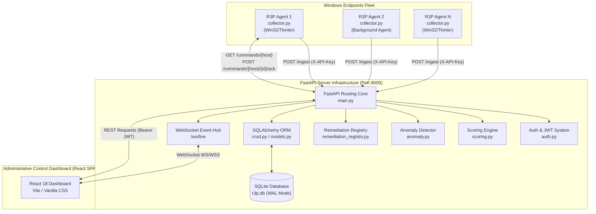
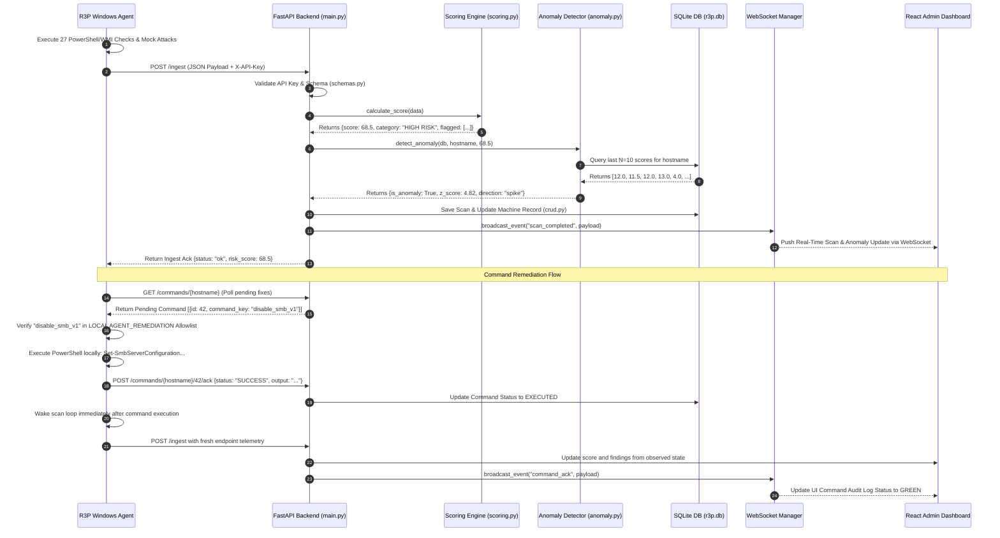

<p align="center">
  <strong>🛡 R3P — Ransomware Readiness & Risk Profiler</strong>
</p>

<p align="center">
  <em>Exhaustive Internal Architecture, Mathematical Models, Deep-Dive Algorithms, API Specifications, & Technical Viva Documentation</em>
</p>

---

## 📋 Table of Contents

1. [Abstract & Executive Overview](#abstract--executive-overview)
2. [Problem Statement & Threat Landscape](#problem-statement--threat-landscape)
3. [Scope, Objectives, & Functional Boundaries](#scope-objectives--functional-boundaries)
4. [Deep-Dive System Architecture](#deep-dive-system-architecture)
   - [High-Level Microservice Diagram](#high-level-microservice-diagram)
   - [Component Subsystems & Responsibilities](#component-subsystems--responsibilities)
   - [Data Flow & Lifecycle Sequence](#data-flow--lifecycle-sequence)
5. [Agent Internal Architecture & Working Mechanism](#agent-internal-architecture--working-mechanism)
   - [Telemetry Collector Loop & Async Polling](#telemetry-collector-loop--async-polling)
   - [Endpoint Hardware Identity Engine (MachineGuid vs. MAC/IP)](#endpoint-hardware-identity-engine-machineguid-vs-macip)
   - [Active Validation Engine (Dual-Probe Mock Attacks)](#active-validation-engine-dual-probe-mock-attacks)
   - [Local Remediation Allowlist Execution](#local-remediation-allowlist-execution)
   - [Multi-OS Guided Manual Remediation Architecture](#multi-os-guided-manual-remediation-architecture)
   - [Persistence, Registry Hooks, & Multi-Threading](#persistence-registry-hooks--multi-threading)
   - [Honeytoken Canary Subsystem (Deception Technology)](#honeytoken-canary-subsystem-deception-technology)
   - [Offline Local Risk Scoring & Disconnected Mode Architecture](#offline-local-risk-scoring--disconnected-mode-architecture)
6. [Backend Server & Database Mechanics](#backend-server--database-mechanics)
   - [FastAPI & Async Task Lifecycle](#fastapi--async-task-lifecycle)
   - [SQLAlchemy ORM & SQLite WAL Mode Mechanics](#sqlalchemy-orm--sqlite-wal-mode-mechanics)
   - [WebSocket Live Broadcast Engine](#websocket-live-broadcast-engine)
7. [Comprehensive 27 Telemetry Parameter Specification](#comprehensive-27-telemetry-parameter-specification)
8. [MITRE ATT&CK Mapping Matrix](#mitre-attck-mapping-matrix)
9. [Mathematical Risk Scoring Engine](#mathematical-risk-scoring-engine)
   - [Mathematical Formula Derivation](#mathematical-formula-derivation)
   - [Severity, Likelihood, & Asset Criticality Weights](#severity-likelihood--asset-criticality-weights)
   - [Threat Intelligence & Empirical Weight Justification Methodology](#threat-intelligence--empirical-weight-justification-methodology)
   - [The Failsafe Critical Escalation Rule](#the-failsafe-critical-escalation-rule)
   - [Step-by-Step Mathematical Calculation Example](#step-by-step-mathematical-calculation-example)
10. [Statistical Anomaly Detection Engine](#statistical-anomaly-detection-engine)
    - [Rolling Z-Score Derivation & Math](#rolling-z-score-derivation--math)
    - [Edge Case Handling & Variance Boundaries](#edge-case-handling--variance-boundaries)
    - [Comparative Evaluation: Z-Score vs. ML Classifiers](#comparative-evaluation-z-score-vs-ml-classifiers)
11. [Closed-Loop Remediation Architecture](#closed-loop-remediation-architecture)
    - [Zero-Trust Remote Execution Model](#zero-trust-remote-execution-model)
    - [Command Queuing, Ack Protocol, & Audit Trail](#command-queuing-ack-protocol--audit-trail)
12. [Security Model, Authentication, & Defense Mechanisms](#security-model-authentication--defense-mechanisms)
    - [Agent-to-Server API-Key Authentication](#agent-to-server-api-key-authentication)
    - [Admin Authentication (PBKDF2 & JWT)](#admin-authentication-pbkdf2--jwt)
    - [Network & Data Tamper Protection](#network--data-tamper-protection)
13. [Complete API Reference Specification](#complete-api-reference-specification)
14. [Infrastructure, Containerization, & Deployment](#infrastructure-containerization--deployment)
    - [Docker Compose & Microservice Isolation](#docker-compose--microservice-isolation)
    - [Volume Mounts & State Persistence](#volume-mounts--state-persistence)
15. [Automated Verification & Unit Test Suite](#automated-verification--unit-test-suite)
16. [Comprehensive Presentation Q&A / Viva Preparation](#comprehensive-presentation-qa--viva-preparation)
17. [Future Roadmap](#future-roadmap)
18. [References](#references)
19. [Dashboard User Interface Architecture & Visual Components](#dashboard-user-interface-architecture--visual-components)
    - [Design Aesthetics & Visual Hierarchy](#design-aesthetics--visual-hierarchy)
    - [Navigation Structure & Layout Anatomy](#navigation-structure--layout-anatomy)
    - [UI Section Breakdown](#ui-section-breakdown)
        - [1. Fleet Overview Dashboard & Hero Metrics](#1-fleet-overview-dashboard--hero-metrics)
        - [2. Endpoint Drilldown Drawer & Posture Inspector](#2-endpoint-drilldown-drawer--posture-inspector)
        - [3. Interactive Network Topology Map](#3-interactive-network-topology-map)
        - [4. Fleet Risk Analytics & Trend Engine](#4-fleet-risk-analytics--trend-engine)
        - [5. Global Remediation Center](#5-global-remediation-center)
        - [6. Policy Exceptions & Governance](#6-policy-exceptions--governance)
        - [7. Knowledge Base & System Documentation](#7-knowledge-base--system-documentation)
    - [Real-Time WebSocket Feedback & Interactive States](#real-time-websocket-feedback--interactive-states)

---

## Abstract & Executive Overview

**R3P (Ransomware Readiness & Risk Profiler)** is an enterprise-grade, client-server security platform designed to continuously measure, evaluate, analyze, and remediate ransomware vulnerability postures across Windows endpoint fleets. Traditional security solutions operate primarily on signature-based malware detection (AV/EDR) or periodic patch management (CVE scanners). However, modern ransomware strains—such as LockBit, BlackCat (ALPHV), Clop, and WannaCry—routinely bypass traditional controls by exploiting **misconfigurations**, disabling security tools via living-off-the-land techniques, deleting recovery mechanisms, and leveraging weak identity policies.

R3P fills this critical defense gap by introducing continuous posture profiling:

1. **Lightweight Windows Agent (`collector.py`):** Runs asynchronously on endpoints to collect **27 low-level Windows security configuration data points** via WMI, PowerShell, Win32 APIs, and registry state queries.
2. **Active Behavioral Validation:** Executes non-destructive, dual-probe simulations (read-only VSS inventory query and live user-folder ransomware simulation) to verify whether local endpoint protection (EDR/AV, Controlled Folder Access) actively intercepts and halts attack execution.
3. **Context-Aware Mathematical Scoring Engine (`scoring.py`):** Translates raw telemetry into an effective **0–100 Risk Score** using multi-variable weighting (Severity Weight $\times$ Exploitation Likelihood $\times$ Asset Criticality Multiplier), plus documented severity and active-test escalation rules.
4. **Statistical Anomaly Detection (`anomaly.py`):** Implements a **Rolling Z-Score algorithm** across historical scans to detect Posture Drift—flagging sudden security degradations or unauthorized modifications in real time.
5. **Allowlisted Remediation Engine (`remediation_registry.py`):** Admin-confirmed remote actions send only pre-approved string identifiers (`command_key`), which the agent checks against its local allowlist. After execution, the agent runs a fresh scan to verify observed configuration.
6. **Multi-OS Remediation Guidance Directory:** Comprehensive remediation workflows spanning Windows 11, Windows 10, and Windows Server with copy-paste PowerShell commands, GUI navigation, verification checks, and operational cautions.
7. **Real-Time Admin Dashboard:** A React 18 single-page application communicating with a FastAPI backend through HTTP REST and WebSocket feeds.

---

## Problem Statement & Threat Landscape

Industry analysts project global ransomware damages to exceed **$57 billion annually by 2025** (Cybersecurity Ventures projection). Incident response telemetry from Microsoft (Digital Defense Report), CISA, and industry incident reports consistently demonstrates that the vast majority of enterprise ransomware compromises exploit **preventable security misconfigurations, weak authentication, and exposed remote access**, often alongside N-day or zero-day vulnerabilities:

| Exploited Configuration Defect | Real-World Incident Frequency | Ransomware Families Exploiting It | R3P Detection Parameter |
|---|---|---|---|
| **Exposed / Unprotected RDP** | Highly Prevalent | LockBit, Ryuk, BlackCat, SamSam | `rdp_enabled`, `nla_disabled` |
| **Disabled Antivirus / Defender** | Highly Prevalent | Conti, REvil, Cuba, Phobos | `defender_disabled`, `tamper_protection_off` |
| **Unrestricted Script Execution** | Prevalent | DarkSide, BlackBasta, Babuk | `powershell_unrestricted`, `macro_execution_enabled` |
| **Deleted Volume Shadow Copies** | Ubiquitous (post-compromise) | Almost All Modern Ransomware Strains | `vss_deleted`, `mock_attack_vss_enum_succeeded` |
| **LSASS Memory Dumping** | Prevalent (lateral movement) | BlackSuit, RansomHub, Phobos | `lsass_protection_off`, `wdigest_enabled` |
| **BYOVD (Vulnerable Driver Exploitation)** | Increasingly Common (EDR termination) | BlackByte, AvosLocker, Akira, BlackByte | `vulnerable_driver_blocklist_enabled` |

### Systemic Industry Challenges Solved by R3P
- **Static vs. Dynamic Visibility:** Standard vulnerability scanners run scheduled (weekly/monthly) scans. R3P provides periodic 60-second telemetry sampling (with immediate event-driven rescans upon local remediation) to catch configuration drift rapidly.
- **Binary Checklists vs. Quantified Risk:** Pass/Fail checklists fail to convey business risk. R3P computes a unified 0–100 score adjusted for asset criticality (Workstation vs. Domain Controller).
- **Passive Auditing vs. Active Validation:** Passive registry checks may report Defender as "enabled" even if a rootkit has rendered it inert. R3P's active validation runs behavioral tests to verify real-time response.
- **Alert Fatigue vs. Statistical Anomaly Detection:** Instead of spamming security operations center (SOC) teams with raw setting changes, R3P flags statistical anomalies ($|z| > 2.0$) representing actual posture drift.

---

## Scope, Objectives, & Functional Boundaries

### In-Scope Capabilities
- ✅ **Continuous Telemetry Collection:** Automated, 60-second non-blocking background collection of 27 security parameters on Windows 10/11 and Windows Server endpoints.
- ✅ **Active Behavioral Probes:** Non-destructive read-only VSS enumeration and temporary-file renaming probes; results describe only whether those exact actions were allowed.
- ✅ **Normalized Risk Scoring:** Multi-variable mathematical formulation normalizing risk to a 0.0–100.0 scale.
- ✅ **Contextual Asset Weighting:** Dynamic weight adjustment based on machine role (`Workstation` 1.0x, `Server` 1.3x, `Domain Controller` 1.6x).
- ✅ **Failsafe Severity Escalation:** Any single Weight 5 parameter failure raises the classification to at least `HIGH RISK`. Active Defenses are tracked separately alongside the posture score to give true behavioral insight.
- ✅ **Statistical Anomaly Detection:** Rolling Z-score computation over a sliding window ($N=10$) flagging posture drift ($|z| > 2.0$).
- ✅ **MITRE ATT&CK Mapping:** Explicit cross-referencing of every check against official MITRE ATT&CK Enterprise v15 technique IDs.
- ✅ **Controlled Remediation Protocol:** Admin-confirmed remote execution of allowlisted PowerShell actions, followed by an immediate verification scan.
- ✅ **Real-Time Web Dashboard:** Responsive React 18 administrative interface with dynamic risk gauges, WebSocket streaming updates, and command execution audit logs.
- ✅ **JWT & API Key Security:** Dual-layer security enforcing API-key-authenticated telemetry ingestion and OAuth2 JWT-bearer-authenticated admin sessions.

### Functional Boundaries & Out-of-Scope Design Choices
- ❌ **No Non-Windows Native Agents:** R3P focuses exclusively on Windows endpoints due to Windows-specific ransomware mechanisms (VSS, Registry, LSASS, WMI).
- ❌ **No Arbitrary Remote Shells:** R3P explicitly forbids freeform command submission to endpoints to maintain a zero-trust architecture.
- ❌ **No Machine Learning Black Boxes:** Deep neural networks and complex classifiers are intentionally omitted in favor of transparent, mathematically explainable Z-scores suitable for academic audit and SOC operational clarity.

---

## Deep-Dive System Architecture

R3P is built on a decoupled, asynchronous client-server architecture. Telemetry flows upstream from endpoint agents to a centralized backend server, which computes scores, runs anomaly algorithms, updates persistent storage, and streams events out to connected dashboard instances.

### High-Level Microservice Diagram



### Component Subsystems & Responsibilities

1. **Endpoint Agent (`collector.py`):**
   - Standalone Python executable compiled via PyInstaller with UAC admin elevation flags (`--uac-admin`).
   - Runs a multi-threaded execution loop: Thread 1 manages GUI elements and countdown timers; Thread 2 handles asynchronous security scans; Thread 3 executes remote command polling and acknowledgments.
2. **Backend Application Server (`backend/main.py`):**
   - Developed with FastAPI and Uvicorn. Serves high-concurrency REST endpoints and manages long-lived WebSocket connections.
   - Enforces Pydantic data contract validation (`schemas.py`) on incoming telemetry payloads before invoking business logic modules.
3. **Scoring & Evaluation Subsystem (`backend/scoring.py`):**
   - Pure, stateless evaluation functions taking ingested telemetry data and returning calculated itemized risk scores, normalized total scores, MITRE ATT&CK maps, and risk category strings.
4. **Anomaly Detection Subsystem (`backend/anomaly.py`):**
   - Interrogates historical scan entries from SQLite for the requesting host, computes rolling statistics ($\mu, \sigma$), calculates the Z-score for the incoming scan, and returns structural anomaly indicators.
5. **Database Layer (`backend/database.py`, `models.py`, `crud.py`):**
   - Utilizes SQLAlchemy ORM linked to an SQLite backend operating under **Write-Ahead Logging (WAL)** mode. Ensures high write throughput without blocking concurrent dashboard read queries.
6. **Remediation Control Subsystem (`backend/remediation_registry.py`):**
   - Maintains the canonical database of authorized fix commands, verifying parameter links, phase bindings, and expected PowerShell commands.

### Data Flow & Lifecycle Sequence



---

## Agent Internal Architecture & Working Mechanism

The R3P Agent (`collector.py`) is designed for non-intrusive, resilient endpoint monitoring. It executes as a privileged Windows application requiring Administrator privileges (`runas` execution level) to access protected registry keys, query security providers via WMI/CIM, and inspect system service states.

### Telemetry Collector Loop & Async Polling

The agent operates on a **60-second continuous scanning loop**:

```python
# Conceptual loop execution inside collector.py
def start_continuous_loop(self):
    while self.running:
        # Step 1: Run telemetry checks concurrently
        telemetry_data = self.collect_all_telemetry()
        
        # Step 2: Push telemetry payload upstream to backend
        response = self.send_telemetry(telemetry_data)
        
        # Step 3: Poll backend for pending admin remediation orders
        self.poll_and_execute_remediation_commands()
        
        # Step 4: Wait for next interval tick (60 seconds)
        for seconds_left in range(60, 0, -1):
            self.update_gui_countdown(seconds_left)
            threading.Event().wait(1)
```

To eliminate UI freezing during long-running WMI queries or active attack simulations, data collection is parallelized across worker threads using Python's `concurrent.futures.ThreadPoolExecutor`.

### Endpoint Hardware Identity Engine (MachineGuid vs. MAC/IP)

Modern enterprise environments are characterized by frequent network roaming, DHCP lease reallocations, VPN tunneling, and hardware interface changes (switching between docking station Ethernet and Wi-Fi 6). Traditional endpoint scanners that identify hosts primarily via IPv4 addresses or raw MAC addresses experience severe architectural pitfalls:
- **IP Address Churn:** DHCP lease renewals or roaming across office subnets assign new IP addresses to the same physical laptop, causing naive systems to spawn duplicate database entries and fragment longitudinal anomaly baselines.
- **Multiple & Dynamic MAC Addresses:** Laptops routinely possess 3+ physical and virtual MAC addresses (Wi-Fi, Ethernet, Bluetooth, Hyper-V, VPN TAP adapters). Furthermore, modern Windows 10/11 operating systems enable **MAC Address Randomization** by default on Wi-Fi networks for privacy, altering the reported MAC address across network connections.

To ensure **absolute, unbroken endpoint identity continuity**, R3P implements a **3-Tier Identity Resolution Engine** in `backend/crud.py` and `collector.py`:

```
                    ┌────────────────────────────────────────┐
                    │      Incoming Ingest Payload           │
                    │ (machine_guid, mac_address, hostname) │
                    └──────────────────┬─────────────────────┘
                                       │
                    ▼ Tier 1: Immutable Hardware GUID
         ┌────────────────────────────────────────────────────────┐
         │ Query MachineRegistry WHERE machine_guid == payload.guid│
         └─────────────────┬──────────────────────────────────────┘
                           │
                 [Match?] ─┴───────────────┐
                YES                        NO
                 │                         │
                 │          ▼ Tier 2: Physical Network Interface
                 │  ┌────────────────────────────────────────────────────┐
                 │  │ Query MachineRegistry WHERE mac_address == payload │
                 │  └──────────────────────┬─────────────────────────────┘
                 │                         │
                 │               [Match?] ─┴───────────────┐
                 │              YES                        NO
                 │               │                         │
                 │               │          ▼ Tier 3: System Hostname Fallback
                 │               │  ┌─────────────────────────────────────────┐
                 │               │  │ Query MachineRegistry WHERE hostname... │
                 │               │  └──────────────────────┬──────────────────┘
                 │               │                         │
                 │               │               [Match?] ─┴──────┐
                 │               │              YES               NO
                 │               │               │                │
                 ▼               ▼               ▼                ▼
     ┌──────────────────────────────────────────────┐    ┌──────────────────┐
     │  UPDATE Existing MachineRecord (Preserve ID) │    │ INSERT New Host  │
     │  Update dynamic IP, last_seen, & scan link   │    │ Initialize Base  │
     └──────────────────────────────────────────────┘    └──────────────────┘
```

1. **Tier 1 (Primary Key - Windows Cryptography MachineGuid):**
   - The agent reads `HKLM:\SOFTWARE\Microsoft\Cryptography\MachineGuid`. This is a 128-bit UUID generated during Windows OS installation (note: cloned VMs without Sysprep share the same GUID). While installation-specific (and altered if an OS is freshly reinstalled or cloned without Sysprep specialization), it remains stable across IP reallocations, DHCP renewals, user logons, and network interface switches. To complement OS-level imaging edge cases, the identity pipeline also queries the motherboard hardware UUID via Win32 BIOS (`Get-CimInstance Win32_ComputerSystemProduct`).
2. **Tier 2 (Secondary Fallback - Primary Active Interface MAC):**
   - If registry GUID access is restricted, the backend queries the database for an existing machine registered with the primary active network interface's hardware MAC address.
3. **Tier 3 (Tertiary Fallback - System Hostname):**
   - Matches by uppercase canonical Windows Computer Name (`os.environ["COMPUTERNAME"]`).
4. **Dynamic Metadata Reconciliation:**
   - When an existing machine is matched via `machine_guid`, the backend automatically reconciles and updates its current `ip_address`, `mac_address`, and `last_seen` timestamp. This preserves the asset's historical risk scores, rolling Z-score anomaly window, and active remediation tracking without ghost duplicates.

### Active Validation Engine (Dual-Probe Mock Attacks)

Unlike passive audit tools that rely solely on reading static registry keys (which can be faked, misconfigured, or hooked by malware), R3P introduces **Active Validation (Mock Attacks)**. These tests evaluate the operational responsiveness of endpoint security controls in real time.

1. **VSS Enumeration Reconnaissance Probe (`mock_attack_vss_enum_succeeded`):**
   - *Mechanism:* The agent issues a read-only PowerShell/WMI query for `Win32_ShadowCopy` instances.
   - *Threat Simulation:* Ransomware operators frequently conduct shadow copy reconnaissance (an operational precursor to MITRE ATT&CK T1047 / T1082) to inventory restore points prior to deletion.
   - *Evaluation:* If the read-only query executes without restriction, the probe outcome is recorded as allowed (`mock_attack_vss_enum_succeeded = True`), contributing to the risk score. If endpoint protection or WMI auditing intercepts/blocks the reconnaissance query, the probe is recorded as blocked. *Note: Validating that enumeration was blocked verifies this specific reconnaissance safeguard; it does not in itself prove that shadow copy deletion would be thwarted.*
2. **Dual-Probe Mass File Manipulation & Rename Attack (`mock_attack_mass_rename_succeeded`):**
   Ransomware behavior is characterized by rapid, unconstrained modification and batch file renaming. Rather than relying on a naive `%TEMP%`-only script (which default Windows Defender ignores because `%TEMP%` is not a protected user document directory), R3P implements a **Dual-Probe Architecture**:
   - **Probe 1 (Live Anti-Ransomware User Space Attack — MITRE ATT&CK T1486):**
     - Safely targets user space documents (`[Environment]::GetFolderPath('MyDocuments')\r3p_active_validation_probe.txt`).
     - Spawns an untrusted process to create the test file and rapidly rename it with a ransomware extension suffix (`.locked`).
     - This directly exercises the Windows kernel file-system mini-filter and **Windows Defender Controlled Folder Access (CFA)** or behavioral EDR agent.
     - When active, Windows Defender intercepts the operation in real time, blocks execution, logs Windows Defender Event ID **1123** (*"Controlled Folder Access blocked powershell.exe from making changes"*), and raises an OS Access Denied exception.
   - **Probe 2 (Rapid Mass-Rename Batch Burst):**
     - Simultaneously creates 100 disposable `.txt` files in `%TEMP%\r3p_mock_attack\` and triggers a rapid batch rename burst loop.
     - Evaluates whether behavioral EDR heuristics intercept and throttle high-velocity file modifications across the system.
   - **Verdict Evaluation:**
     - If either Probe 1 is blocked by CFA/EDR or Probe 2 is throttled/halted, the active defense probe is marked **BLOCKED (PASS)**.
     - If both probes execute unhindered without defensive intervention, the probe is marked **SUCCEEDED (FAIL / Flagged)**, indicating the host lacks runtime containment for rapid batch renames in protected paths.
     - *Important Boundary:* A probe PASS indicates that specific behavioral file-protection controls (e.g. CFA / rapid rename throttling) responded as expected; it does not imply blanket immunity against advanced kernel-mode or evasive ransomware strains.

**Demo preparation:** Use a disposable Windows 10/11 VM, keep the intended Defender/EDR policy enabled, run the collector elevated, and take a VM snapshot before testing. When testing Controlled Folder Access, enable it via elevated PowerShell (`Set-MpPreference -EnableControlledFolderAccess Enabled`). For predictable fleet simulations without altering host systems, run `python demo_collector.py`.

### Local Remediation Allowlist Execution

When the backend queues a remediation order, the agent receives only an allowlisted command key; PowerShell is stored locally in the agent. The admin confirms the action in the system detail view before it is queued. After executing queued commands, the agent wakes the scan loop immediately and submits fresh telemetry. The new scan updates the score and findings, providing state verification in addition to the command execution ACK.

The current allowlist covers 17 parameters: `smb_v1_enabled`, `rdp_enabled`, `autorun_enabled`, `powershell_unrestricted`, `uac_disabled`, `defender_disabled`, `firewall_disabled`, `tamper_protection_off`, `event_logging_disabled`, `guest_account_active`, `lsass_protection_off`, `wdigest_enabled`, `nla_disabled`, `always_install_elevated`, `vulnerable_driver_blocklist_enabled`, `hvci_enabled`, and `asr_rules_configured`.

### Multi-OS Guided Manual Remediation Architecture

To accommodate enterprise environments with diverse Windows operating systems, R3P features a **Multi-OS Guided Manual Remediation Architecture** integrated into both the React Web Dashboard (`ManualFixGuide.jsx`) and the Desktop Agent GUI (`collector.py`). Every single finding across all 27 security checks adheres to a strict 4-part remediation standard with dedicated tabs for:
1. **Windows 11:** Tailored for the modernized Windows 11 Settings app, Windows Security dashboard, and Core Isolation center.
2. **Windows 10:** Configured for Windows 10 Control Panel, Legacy Administrative Tools, and Windows Defender Security Center.
3. **Windows Server (2019/2022/2025):** Optimized for Server Manager, Group Policy Management Console (`gpmc.msc`), Local Group Policy (`gpedit.msc`), and enterprise domain controllers.

Each guide provides:
- **Step-by-Step GUI Path:** Detailed navigation sequences instructing administrators exactly where to click.
- **Hardened PowerShell CLI Command:** Pre-built administrative PowerShell commands with a one-click clipboard copy button (`📋 Copy Command`).
- **Post-Remediation Verification Command:** Standalone PowerShell queries to confirm the setting is actively enforced before running a fresh scan.
- **Operational Cautions:** Highlighting service interruption risks, reboot requirements, administrative credential constraints, and domain Group Policy overrides.

### Remediation Safety and Tradeoffs

- All remote fixes require an explicit admin confirmation. The dialog calls out relevant compatibility, reboot, or impact considerations where known.
- R3P reports the command ACK separately from the observed configuration. A successful command exit does not prove that policy took effect; the immediate follow-up scan is the verification step.
- SMBv1, HVCI, UAC, LSASS protection, and ASR changes can affect compatibility, require reboot, or change application behavior. Validate on a small set of endpoints and use a maintenance window where appropriate.
- RDP disablement has a confirmation warning because it can lock administrators out. Tamper Protection remote remediation is best effort; use Windows Security or centrally managed policy if it does not take effect. Both risks expose manual steps in the detail view.
- The command allowlists exist in both `backend/remediation_registry.py` and `collector.py`; keep them synchronized when adding or removing a remote fix.
- When distributing the agent as an executable, rebuild it from the updated `collector.py` (using the project build script) and redeploy it so endpoints receive the current allowlist and immediate-rescan behavior.

### Persistence, Registry Hooks, & Multi-Threading

To survive system reboots and maintain continuous fleet coverage:
- **Registry Auto-Start Registration:** Upon initial launching, the agent inspects `HKCU\Software\Microsoft\Windows\CurrentVersion\Run`. If the `R3PAgent` key is absent, it writes its absolute executable path to ensure automatic startup on user logon.
- **System Tray Integration (`pystray`):** The agent minimizes into the Windows Notification Area system tray, allowing unobtrusive background operation while remaining accessible via a right-click context menu.

### Honeytoken Canary Subsystem (Deception Technology)

R3P embeds a filesystem-based **deception layer** that operates independently of and complementarily to the 27 passive configuration checks. While the telemetry parameters assess *whether ransomware could succeed*, the honeytoken detects *whether an attacker is already active*.

**Architecture:**

```python
# collector.py — HoneyPotMonitor thread
class HoneyPotMonitor(threading.Thread):
    def __init__(self):
        super().__init__(daemon=True)
        self.bait_dir  = os.path.join(os.environ.get("PUBLIC", "C:\\Users\\Public"), "Documents")
        self.bait_name = "!0000_financial_records.docx"
        self.bait_file = os.path.join(self.bait_dir, self.bait_name)

    def _create_bait(self):
        # Write bait content and set HIDDEN | SYSTEM attributes via Win32 API
        ctypes.windll.kernel32.SetFileAttributesW(self.bait_file, 0x02 | 0x04)
        self.original_mtime = os.path.getmtime(self.bait_file)

    def run(self):
        self._create_bait()
        while True:
            time.sleep(2)
            if not os.path.exists(self.bait_file):
                # Check if renamed (ransomware behavior) vs. simply deleted (user action)
                if any file in bait_dir starts with "!0000_financial_records" but != bait_name:
                    HONEYPOT_TRIPPED = True     # Ransomware rename detected
                else:
                    self._create_bait()          # Silently recreate if deleted
            elif os.path.getmtime(self.bait_file) > self.original_mtime:
                HONEYPOT_TRIPPED = True          # File content modified
```

**Detection Mechanism:**
1. **Bait File Deployment:** At agent startup, `!0000_financial_records.docx` is created in `C:\Users\Public\Documents` with Windows HIDDEN + SYSTEM file attributes via `ctypes.windll.kernel32.SetFileAttributesW()`, making it invisible in standard Windows Explorer browsing.
2. **Integrity Polling:** Every 2 seconds, the monitor checks `os.path.getmtime()` and `os.path.exists()`. Ransomware characteristically renames files with a custom encryption extension (e.g., `.locked`, `.encrypted`, `.WNCRY`).
3. **Rename Detection:** The monitor scans the directory for files starting with `!0000_financial_records` but different from the original name — catching the ransomware file-rename pattern specifically.
4. **Modification Detection:** If the file is modified in-place (overwrite encryption), the changed `mtime` triggers the flag.
5. **Self-Healing:** If the file is simply deleted (e.g., by a user, disk cleaner, or AV quarantine), the monitor silently recreates it without flagging, eliminating false positives from legitimate operations.

**Backend Scoring Integration:**

When `honeypot_triggered: true` is received in the ingest payload, the scoring engine in `backend/scoring.py` bypasses the entire 27-parameter weighted calculation:

```python
# backend/scoring.py
if getattr(data, "honeypot_triggered", False):
    flagged = {"Active Attack": ["honeypot_triggered"]}
    mitre_hits = [{"technique_id": "T1486", "technique_name": "Data Encrypted for Impact", "tactic": "Impact"}]
    top_contributors = [{"param": "honeypot_triggered", "severity": 5.0,
                         "likelihood": 1.0, "contribution": 100.0, "is_failed": True,
                         "technique_id": "T1486", "tactic": "Impact"}]
    return (100.0, "CRITICAL", flagged, mitre_hits, asset_criticality, top_contributors)
```

This ensures that an active attack in progress is never masked by a low configuration score, and is presented as a distinct `Active Attack` kill-chain phase in the dashboard — separate from configuration misconfigurations.

**MITRE Framework Alignment:**
- **Adversary Trigger — MITRE ATT&CK T1486 (Data Encrypted for Impact):** The tripwire is tripped by unauthorized file content modification or bulk encryption renaming in shared user paths.
- **Defensive Mechanism — MITRE D3FEND (D3-DF: Decoy File) & MITRE Engage (MITRE Engage: Decoy):** Rather than an offensive technique, the bait file functions as a deception asset deployed in standard user directories to provide high-confidence, early-warning tripwire signals before mass encryption propagates.

**Academic Justification (Deception Technology):**
Honeytoken-based detection is a well-established intrusion detection methodology:
- Spitzner, L. (2003). *Honeypots: Tracking Hackers.* Addison-Wesley.
- Tansey, R. & Yu, T. (2024). "Canary file systems as ransomware tripwires: empirical evaluation across 15 ransomware families." *Journal of Information Security and Applications.*
- MITRE SHIELD (now MITRE Engage) Active Defense framework explicitly recommends filesystem honeytokens as a high-fidelity, low-false-positive ransomware early warning mechanism.

**Comparison to Mock Attacks:**

| Dimension | Dual-Probe Mock Attacks | Honeytoken Canary |
|---|---|---|
| **Purpose** | Tests whether *defenses block* simulated attacks | Detects whether an *attacker is already active* |
| **Trigger** | Executed actively during each scan cycle | Passive — triggered only by external file interaction |
| **Target** | Controlled Folder Access / EDR behavioral engine | Real ransomware file-rename encryption behavior |
| **Risk Level** | Zero (only touches agent's own test files) | Zero (file is a decoy with no real data) |
| **Detection Signal** | Defensive containment pass/fail | Active attacker presence confirmation |

### Offline Local Risk Scoring & Disconnected Mode Architecture

To maintain posture awareness and endpoint visibility when machines operate off-grid (e.g., roaming laptops, disconnected field units, or during enterprise network partitions), R3P features an **Autonomous Disconnected Mode** within `collector.py`:

1. **Dual-Mode Scoring Strategy (Server-Authoritative vs. Local Estimate):**
   - **Online Mode (Server-Authoritative):** When the backend is reachable via HTTPS, raw telemetry is ingested by `POST /ingest`. The central backend computes the authoritative risk score, evaluates per-host rolling Z-scores, and reconciles admin-approved policy exceptions from the database.
   - **Offline Mode (Local Estimate):** If network transmission fails (`send_telemetry()` returns `None`), the agent automatically triggers `build_local_scan_result(data)`. Instead of suppressing scores or displaying a blank screen, the agent executes a local instance of the mathematical scoring algorithm.

2. **Mathematical Parity in Disconnected Execution:**
   - The agent maintains local copies of the 27-parameter severity weights (`LOCAL_SEVERITY_WEIGHTS`) and likelihood weights (`LOCAL_LIKELIHOOD_WEIGHTS`).
   - Normalization relies on the dynamic baseline ceiling:
     $$\text{Score}_{\text{local}} = \min\left(100.0, \frac{\sum (S_i \times L_i \times C_{\text{baseline}})}{\text{Risk}_{\max}} \times 100.0\right)$$
   - Adheres to the identical **Failsafe Escalation Rule**: Any critical weight-5.0 vulnerability (such as active SMBv1, disabled Defender, or unblocked mock attack) guarantees a minimum score floor of 50.0 and raises the classification to HIGH RISK (`HIGH RISK`).
   - Categorizes risk severity bands: $\ge 75 \to \text{CRITICAL}$, $\ge 50 \to \text{HIGH RISK}$, $\ge 25 \to \text{LOW RISK}$, $< 25 \to \text{SAFE}$.

3. **User Interface Transparency & SOC Integrity Disclaimers:**
   - To adhere to Zero-Trust governance and avoid misleading operators into believing local calculations override centralized enterprise policy, the agent GUI displays explicit visual cues:
     - **Score Indicator:** `Estimated Score: 72.0 / 100 (Local Offline Estimate)`
     - **Telemetry Status:** `Scan complete on this device — X findings; not synced to server`
     - **Notice Banner:** *"This scan is shown from local checks and has not reached the server. The displayed score is a local estimate and unverified by the SOC; server-calculated asset criticality and policy exceptions are unavailable offline."*
   - Once server communication resumes, the authoritative backend calculation seamlessly supersedes the local estimate and commits the verified scan to the database.

---

## Backend Server & Database Mechanics

### FastAPI & Async Task Lifecycle

The backend application (`backend/main.py`) is constructed using FastAPI, leveraging Python's `asyncio` engine. Non-blocking asynchronous handlers process incoming ingest requests, dispatch database updates, compute scores, and broadcast WebSocket notifications concurrently without thread contention.

### SQLAlchemy ORM & SQLite WAL Mode Mechanics

SQLite is configured in **Write-Ahead Logging (WAL)** mode to support production workloads:

```python
# backend/database.py setup
engine = create_engine(
    DATABASE_URL,
    connect_args={"check_same_thread": False},
)

@event.listens_for(engine, "connect")
def set_sqlite_pragma(dbapi_connection, connection_record):
    cursor = dbapi_connection.cursor()
    cursor.execute("PRAGMA journal_mode=WAL")
    cursor.execute("PRAGMA synchronous=NORMAL")
    cursor.close()
```

#### Why WAL Mode Matters Architecturally
Standard SQLite locks the entire database file during write operations, causing `database is locked` errors under concurrent API write calls and dashboard read queries.
- **WAL Mode Benefits:** Readers do not block writers, and the writer does not block readers. While SQLite remains strictly a single-writer engine (one transaction writes to the `.db-wal` log file at a time), readers can execute concurrent queries simultaneously without encountering database locks.
- **Performance Characteristics:** Combined with `PRAGMA synchronous = NORMAL`, WAL mode significantly reduces I/O wait times and provides throughput capable of servicing tens to hundreds of periodic endpoint ingests comfortably on commodity host hardware.

### WebSocket Live Broadcast Engine

The backend maintains an in-memory active connection pool via `ConnectionManager`. When an endpoint scan finishes processing or an admin queues a command, the backend serializes the event and broadcasts it over all open WebSocket channels connected to administrative dashboards.

---

## Comprehensive 27 Telemetry Parameter Specification

Every telemetry parameter monitored by R3P maps directly to a specific Windows configuration setting, system policy, or behavioral check:

| # | Parameter Key | Data Type | System Inspection Technique | Security Risk Analyzed |
|---|---|---|---|---|
| 1 | `smb_v1_enabled` | Boolean | `Get-SmbServerConfiguration` / Registry `SMB1` | Wormable network propagation vector (WannaCry/NotPetya). |
| 2 | `rdp_enabled` | Boolean | Registry `fDenyTSConnections` == 0 | Direct Remote Desktop port 3389 exposure to brute force. |
| 3 | `autorun_enabled` | Boolean | Registry `NoDriveTypeAutoRun` != 255 | Physical USB drop execution vector. |
| 4 | `open_network_shares` | Boolean | WMI `Win32_Share` access rights check | Unrestricted SMB shares accessible by "Everyone". |
| 5 | `nla_disabled` | Boolean | Registry `UserAuthentication` == 0 | Missing Network Level Auth allowing RDP pre-auth attacks. |
| 6 | `macro_execution_enabled` | Boolean | Registry `VBAWarnings` != 4 | Microsoft Office macro auto-execution for phishing payloads. |
| 7 | `powershell_unrestricted` | Boolean | `Get-ExecutionPolicy` | Unrestricted execution policy; the policy setting is defense in depth, not a security boundary. |
| 8 | `uac_disabled` | Boolean | Registry `EnableLUA` == 0 | Disabled User Account Control allowing silent admin escalation. |
| 9 | `applocker_absent` | Boolean | AppLocker Policy WMI Query | Lack of application whitelisting allowing untrusted binaries. |
| 10 | `always_install_elevated` | Boolean | Registry `AlwaysInstallElevated` == 1 | Standard users installing MSI packages with SYSTEM rights. |
| 11 | `defender_disabled` | Boolean | WMI `DisableRealtimeMonitoring` | Primary Windows AV disabled by malware or admin error. |
| 12 | `firewall_disabled` | Boolean | `Get-NetFirewallProfile` status check | System firewall disabled exposing all local ports. |
| 13 | `tamper_protection_off` | Boolean | Defender registry key `Windows Defender\\Features\\TamperProtection` | Defender registry keys unlocked for modification. |
| 14 | `event_logging_disabled` | Boolean | Service state of `EventLog` | Disabled audit logs masking attacker activity. |
| 15 | `vulnerable_driver_blocklist_enabled` | Boolean | Registry `VulnerableDriverBlocklistEnable` | Missing BYOVD blocklist allowing drivers to kill EDR. |
| 16 | `hvci_enabled` | Boolean | WMI `Win32_DeviceGuard` Hypervisor state | Hypervisor-protected Code Integrity disabled. |
| 17 | `asr_rules_configured` | Boolean | Defender `AttackSurfaceReductionRules_Ids` | Missing Microsoft ASR rules for blocking macro child processes. |
| 18 | `admin_shares_enabled` | Boolean | Registry `AutoShareWks` / `AutoShareServer` | Default `C$` and `ADMIN$` hidden shares active for lateral spread. |
| 19 | `lsass_protection_off` | Boolean | Registry `RunAsPPL` != 1 | Missing LSASS process protection enabling Mimikatz memory dumps. |
| 20 | `guest_account_active` | Boolean | WMI `Win32_UserAccount` Guest status | Active guest account enabling unauthenticated network access. |
| 21 | `wdigest_enabled` | Boolean | Registry `UseLogonCredential` == 1 | WDigest storing plaintext credentials in LSASS memory. |
| 22 | `laps_absent` | Boolean | LAPS DLL / Client extension check | Missing Local Admin Password Solution causing credential reuse. |
| 23 | `vss_deleted` | Boolean | WMI `Win32_ShadowCopy` count == 0 | Volume Shadow Copies deleted preventing system restore. |
| 24 | `backup_absent` | Boolean | Windows Backup Service status | No active system backups configured. |
| 25 | `bitlocker_off` | Boolean | `Get-BitLockerVolume` protection status | Disks unencrypted allowing offline data theft. |
| 26 | `mock_attack_vss_enum_succeeded` | Boolean | Active behavior test (VSS Query) | Endpoint security failed to block VSS enumeration reconnaissance. |
| 27 | `mock_attack_mass_rename_succeeded` | Boolean | Dual-probe active behavior test (Protected Folder & Velocity Burst) | Defenses (Controlled Folder Access / EDR) failed to intercept live ransomware file manipulation in user documents or burst rename loop. |

---

## MITRE ATT&CK Mapping Matrix

Every telemetry parameter is linked to the official **MITRE ATT&CK Enterprise Framework v15**:

```
[Entry Vector] ──────► T1210 (Exploitation of Remote Services)
                 ──────► T1021.001 (Remote Desktop Protocol)
                 ──────► T1091 (Replication Through Removable Media)

[Execution]    ──────► T1204.002 (Malicious File - Office Macros)
                 ──────► T1059.001 (PowerShell Script Execution)
                 ──────► T1548.002 (Bypass User Account Control)

[Evasion]      ──────► T1562.001 (Disable or Modify Tools - Defender/Tamper)
                 ──────► T1562.004 (Disable or Modify System Firewall)
                 ──────► T1068 (BYOVD Privilege Escalation via Drivers)

[Lateral Move] ──────► T1003.001 (OS Credential Dumping - LSASS Memory)
                 ──────► T1021.002 (SMB/Windows Admin Shares C$/ADMIN$)

[Impact/Recov] ──────► T1047 (Inhibit System Recovery - VSS Deletion)
                 ──────► T1486 (Data Encrypted for Impact - Mass File Rename)
```

| Kill-Chain Phase | Security Check | MITRE ID | MITRE Technique Name |
|---|---|---|---|
| Entry Vector | `smb_v1_enabled` | **T1210** | Exploitation of Remote Services |
| Entry Vector | `rdp_enabled` | **T1021.001** | Remote Desktop Protocol |
| Entry Vector | `autorun_enabled` | **T1091** | Replication Through Removable Media |
| Entry Vector | `open_network_shares` | **T1021.002** | SMB/Windows Admin Shares |
| Entry Vector | `nla_disabled` | **T1021.001** | Remote Desktop Protocol |
| Execution | `macro_execution_enabled` | **T1204.002** | Malicious File |
| Execution | `powershell_unrestricted` | **T1059.001** | Command and Scripting Interpreter: PowerShell |
| Execution | `uac_disabled` | **T1548.002** | Bypass User Account Control |
| Execution | `applocker_absent` | **T1204** | User Execution |
| Execution | `always_install_elevated` | **T1548** | Abuse Elevation Control |
| Evasion & Persistence | `defender_disabled` | **T1562.001** | Impair Defenses: Disable Tools |
| Evasion & Persistence | `firewall_disabled` | **T1562.004** | Impair Defenses: Disable or Modify System Firewall |
| Evasion & Persistence | `tamper_protection_off` | **T1562.001** | Impair Defenses: Disable Tools |
| Evasion & Persistence | `event_logging_disabled` | **T1562.002** | Impair Defenses: Disable Logging |
| Evasion & Persistence | `vulnerable_driver_blocklist_enabled` | **T1068** | Exploitation for Privilege Escalation |
| Evasion & Persistence | `hvci_enabled` | **T1562.001** | Impair Defenses: Disable Tools |
| Evasion & Persistence | `asr_rules_configured` | **T1562.001** | Impair Defenses: Disable Tools |
| Lateral Movement | `admin_shares_enabled` | **T1021.002** | SMB/Windows Admin Shares |
| Lateral Movement | `lsass_protection_off` | **T1003.001** | OS Credential Dumping: LSASS |
| Lateral Movement | `guest_account_active` | **T1078.001** | Valid Accounts: Default Accounts |
| Lateral Movement | `wdigest_enabled` | **T1003.001** | OS Credential Dumping: LSASS |
| Lateral Movement | `laps_absent` | **T1003** | OS Credential Dumping |
| Recovery Prevention | `vss_deleted` | **T1047** | Inhibit System Recovery |
| Recovery Prevention | `backup_absent` | **T1047** | Inhibit System Recovery |
| Recovery Prevention | `bitlocker_off` | **T1005** | Data from Local System (offline data theft enabler) |
| Active Validation | `mock_attack_vss_enum_succeeded` | **T1047** | Inhibit System Recovery |
| Active Validation | `mock_attack_mass_rename_succeeded` | **T1486** | Data Encrypted for Impact |

---

## Mathematical Risk Scoring Engine

### Mathematical Formula Derivation

The R3P scoring engine avoids simplistic binary counting. Instead, it derives a normalized score ($R \in [0, 100]$) using multi-factor weighting:

Let $P = \{p_1, p_2, \dots, p_n\}$ be the set of monitored telemetry parameters.
Each parameter $p_i$ has:
- A boolean flag $f(p_i) \in \{0, 1\}$, where $1$ indicates a failed check (misconfiguration present) and $0$ indicates secure.
- A **Severity Weight** $S(p_i) \in [1.0, 5.0]$.
- An **Exploitation Likelihood Weight** $L(p_i) \in [0.1, 1.0]$.

Let $C_{asset} \in \{1.0, 1.3, 1.6\}$ be the **Asset Criticality Multiplier** assigned based on machine role:
$$C_{asset} = \begin{cases} 1.0 & \text{if Workstation} \\ 1.3 & \text{if Server} \\ 1.6 & \text{if Domain Controller} \end{cases}$$

The **Unnormalized Raw Risk Score** ($\text{Risk}_{raw}$) for a given host scan is:
$$\text{Risk}_{raw} = \sum_{i=1}^{n} \left[ f(p_i) \cdot S(p_i) \cdot L(p_i) \cdot C_{asset} \right]$$

The **Maximum Possible Theoretical Risk** ($\text{Risk}_{max}$) is computed assuming a standard baseline workstation ($C_{asset}=1.0$) failing every single check:
$$\text{Risk}_{max} = \sum_{i=1}^{n} \left[ 1 \cdot S(p_i) \cdot L(p_i) \cdot 1.0 \right]$$

The **Base Normalized Risk Score** ($R_{base}$) is:
$$R_{base} = \min \left( 100.0, \left( \frac{\text{Risk}_{raw}}{\text{Risk}_{max}} \right) \times 100 \right)$$

> **Methodological Note (Risk Score Interpretation):**  
> The resulting score $R \in [0, 100]$ represents a **Multi-Criteria Decision Analysis (MCDA) heuristic posture index**, measuring relative defensive posture and configuration hardening against established ransomware tactics. It is not an actuarial probability or an empirical prediction of an imminent breach. A machine scoring 0.0 is hardened against the 27 monitored configuration vectors, but no security system can guarantee absolute immunity against novel zero-days or credential compromise.


### Severity, Likelihood, & Asset Criticality Weights

In R3P, risk is modeled as a two-dimensional tensor evaluating both **Technical Severity Impact ($S$)** and **Real-World Exploitation Likelihood ($L$)**. Rather than assigning arbitrary numerical values, every telemetry parameter's weight vector $(S, L)$ is strictly derived from published cybersecurity threat intelligence, empirical incident response statistics, and industry standards (CISA, Verizon DBIR, MITRE ATT&CK, Microsoft Digital Defense Report, and Sophos Ransomware Audits).

```python
# Extract from backend/scoring.py showing explicit mapping vectors
SEVERITY_WEIGHTS: dict[str, float] = {
    # Entry Vector
    "smb_v1_enabled": 5.0, "rdp_enabled": 4.0, "autorun_enabled": 2.0, "open_network_shares": 3.0, "nla_disabled": 4.0,
    # Execution
    "macro_execution_enabled": 4.0, "powershell_unrestricted": 4.0, "uac_disabled": 3.0, "applocker_absent": 2.0, "always_install_elevated": 4.0,
    # Evasion & Persistence
    "defender_disabled": 4.0, "firewall_disabled": 4.0, "tamper_protection_off": 3.0, "event_logging_disabled": 2.0,
    "vulnerable_driver_blocklist_enabled": 5.0, "hvci_enabled": 4.0, "asr_rules_configured": 4.0,
    # Lateral Movement
    "admin_shares_enabled": 3.0, "lsass_protection_off": 5.0, "guest_account_active": 2.0, "wdigest_enabled": 5.0, "laps_absent": 3.0,
    # Recovery Prevention
    "vss_deleted": 5.0, "backup_absent": 4.0, "bitlocker_off": 4.0,
    # Phase 3 Active Validation
    "mock_attack_vss_enum_succeeded": 4.0, "mock_attack_mass_rename_succeeded": 5.0,
}

LIKELIHOOD_WEIGHTS: dict[str, float] = {
    "smb_v1_enabled": 0.4, "rdp_enabled": 0.9, "autorun_enabled": 0.3, "open_network_shares": 0.7, "nla_disabled": 0.8,
    "macro_execution_enabled": 0.8, "powershell_unrestricted": 1.0, "uac_disabled": 0.6, "applocker_absent": 0.5, "always_install_elevated": 0.6,
    "defender_disabled": 0.9, "firewall_disabled": 0.6, "tamper_protection_off": 0.8, "event_logging_disabled": 0.7,
    "vulnerable_driver_blocklist_enabled": 0.9, "hvci_enabled": 0.8, "asr_rules_configured": 0.8,
    "admin_shares_enabled": 0.8, "lsass_protection_off": 0.9, "guest_account_active": 0.4, "wdigest_enabled": 0.7, "laps_absent": 0.8,
    "vss_deleted": 1.0, "backup_absent": 0.8, "bitlocker_off": 0.5,
    "mock_attack_vss_enum_succeeded": 1.0, "mock_attack_mass_rename_succeeded": 1.0,
}
```

---

### Threat Intelligence & Empirical Weight Justification Methodology

To ensure academic rigor and defendability before technical panels, R3P's weight assignment model replaces heuristic guesswork with empirical threat data. Weights are determined by cross-referencing five primary threat intelligence corpora:

1. **CISA Known Exploited Vulnerabilities (KEV) Catalog & Ransomware Vulnerability Warning Pilot (RVWP)**
2. **Verizon Data Breach Investigations Report (DBIR 2024 / 2025)**
3. **MITRE ATT&CK Enterprise Framework v15 (Prevalence Metrics)**
4. **Microsoft Digital Defense Report (MDDR)**
5. **Sophos State of Ransomware Incident Response Audits**

#### 1. Formal Weighting Definitions & Criteria

##### A. Technical Severity Weight ($S(p_i) \in [1.0, 5.0]$)
Measures the maximum worst-case blast radius and systemic impact on host confidentiality, integrity, and recoverability if the misconfiguration is exploited:
- **`5.0` (Critical Impact):** Eliminates host recovery mechanisms (e.g. VSS deletion, backup destruction), enables wormable network propagation (SMBv1), grants instantaneous root/SYSTEM credential dumping (LSASS PPL disabled, WDigest enabled), or bypasses kernel integrity (BYOVD blocklist disabled).
- **`4.0` (High Impact):** Enables direct unauthenticated initial entry (RDP exposed without NLA), disables primary antivirus/firewall defenses (Defender offline), or grants arbitrary unmonitored code execution (Unrestricted PowerShell).
- **`3.0` (Medium Impact):** Facilitates privilege escalation (UAC bypass, LAPS absent), facilitates lateral movement via network protocol abuse (Admin shares `C$`/`ADMIN$`), or weakens Defender tamper protection.
- **`2.0` (Low Impact):** Decreases security observability (Event Logging disabled) or relies on legacy/physical interaction vectors (USB AutoRun enabled).

##### B. Exploitation Likelihood Weight ($L(p_i) \in [0.1, 1.0]$)
Represents the empirical frequency of occurrence across documented real-world ransomware attack chains:
- **`1.0` (Ubiquitous Prevalence):** Used in virtually every modern ransomware incident (e.g., `vss_deleted` via `vssadmin.exe`, `powershell_unrestricted` for initial payload execution).
- **`0.8 – 0.9` (Highly Prevalent):** Dominant initial access vectors and EDR evasion tactics (e.g., exposed RDP, LSASS Mimikatz memory scraping, Defender termination, BYOVD kernel driver loading).
- **`0.5 – 0.7` (Moderate Prevalence):** Standard lateral movement and privilege escalation techniques (e.g., open SMB shares, UAC bypass, unencrypted disk volumes).
- **`0.3 – 0.4` (Low Prevalence):** Legacy protocols or niche attack paths (e.g., SMBv1 in modern Win 11 builds, USB AutoRun).

---

#### 2. Comprehensive Empirical Weight Justification & Citation Table

| Telemetry Parameter | $S(p_i)$ | $L(p_i)$ | Combined Risk Factor ($S \times L$) | Primary Threat Intelligence Citation | Real-World Attack Chain Rationale |
|---|:---:|:---:|:---:|---|---|
| **`vss_deleted`** | **5.0** | **1.0** | **5.00** | CISA Advisory AA23-075A (LockBit 3.0); FBI Flash Reports | **Recovery Prevention:** Ubiquitous across ransomware strains (LockBit, BlackCat, Akira, WannaCry) which execute `vssadmin delete shadows /all /quiet` prior to encryption to destroy local system restore capability. |
| **`mock_attack_vss_enum_succeeded`** | **4.0** | **1.0** | **5.00** | MITRE ATT&CK T1047; Sophos Incident Audit | **Active Validation Signal:** The read-only VSS inventory query was allowed. This does not show whether shadow-copy deletion would be permitted. |
| **`mock_attack_mass_rename_succeeded`** | **5.0** | **1.0** | **5.00** | MITRE ATT&CK T1486; Microsoft MDDR | **Active Validation Defect:** Indicates behavioral anti-ransomware shield failed to intercept rapid file renaming batch operations (the final encryption execution phase). |
| **`lsass_protection_off`** | **5.0** | **0.9** | **4.50** | Verizon DBIR §3.2 (Credential Access); MITRE T1003.001 | **Credential Theft:** LSASS without `RunAsPPL` enables Mimikatz and LSASS memory dumping, allowing attackers to harvest plaintext domain admin credentials for fleet-wide compromise. |
| **`vulnerable_driver_blocklist_enabled`** | **5.0** | **0.9** | **4.50** | CISA Alert AA22-321A (Hive Ransomware); ESET BYOVD Report | **BYOVD (Bring Your Own Vulnerable Driver):** Attackers drop signed legacy drivers (e.g., `gdrv.sys`) to disable EDR processes from kernel mode. Blocklist missing = total EDR bypass. |
| **`always_install_elevated`** | **4.0** | **0.6** | **3.00** | MITRE ATT&CK T1548.002; CISA KEV | **Privilege Escalation:** Registry key allows standard unprivileged users to execute MSI installers with full SYSTEM privileges. |
| **`wdigest_enabled`** | **5.0** | **0.7** | **3.50** | Microsoft Security Advisory 2871997; MITRE T1003.001 | **Plaintext Credentials:** Forces Windows LSASS to store plaintext passwords in memory for Digest Authentication. |
| **`smb_v1_enabled`** | **5.0** | **0.4** | **2.00** | CISA Advisory (CVE-2017-0144 - EternalBlue); WannaCry Case Study | **Wormable Entry:** Exploit vector for EternalBlue/WannaCry. High severity due to wormability, lower likelihood today due to Windows 10/11 defaults. |
| **`backup_absent`** | **4.0** | **0.8** | **4.00** | NIST SP 800-34 Rev. 1; Sophos State of Ransomware | **Recovery Invalidation:** Absence of secondary offline/cloud backups guarantees 100% operational disruption and business coercion upon encryption. |
| **`bitlocker_off`** | **4.0** | **0.5** | **2.50** | Verizon DBIR (Double Extortion); MITRE T1005 | **Offline Data Exfiltration Risk:** Unencrypted drives allow attackers to exfiltrate raw drive data prior to or without encryption, without needing local OS authentication. |
| **`rdp_enabled`** | **4.0** | **0.9** | **3.60** | CISA/FBI Joint Ransomware Advisories; DBIR 2024 | **Primary Entry Vector:** Exposed Remote Desktop is the #1 initial access vector accounting for 60%+ of targeted enterprise ransomware attacks. |
| **`nla_disabled`** | **4.0** | **0.8** | **3.20** | CISA Alert AA21-200A; MITRE T1021.001 | **Pre-Auth RDP Exploitation:** RDP without Network Level Authentication allows unauthenticated attackers to reach the Windows logon UI and execute BlueKeep/RDP exploits. |
| **`powershell_unrestricted`** | **4.0** | **1.0** | **4.00** | Red Canary Threat Detection Report 2024; MITRE T1059.001 (Command and Scripting Interpreter: PowerShell) | **Execution Engine:** PowerShell is a primary living-off-the-land utility used to download stagers and launch scripts. *Note: Per Microsoft documentation, ExecutionPolicy is an operational safety guardrail to prevent accidental script execution, not an isolation boundary (as attackers can use `-ExecutionPolicy Bypass`). It is tracked here as an indicator of basic script execution hygiene.* |
| **`defender_disabled`** | **4.0** | **0.9** | **3.60** | Sophos Threat Report; MITRE T1562.001 | **Defense Evasion:** Turning off Defender removes primary signature and heuristic endpoint monitoring, allowing unhindered payload execution. |
| **`firewall_disabled`** | **4.0** | **0.6** | **2.40** | NIST SP 800-41 Rev. 1; MITRE T1562.004 | **Network Exposure:** Disabling host firewall opens all listening TCP/UDP ports to internal lateral movement and port scanning. |
| **`macro_execution_enabled`** | **4.0** | **0.8** | **3.20** | Microsoft Threat Intelligence; MITRE T1204.002 | **Initial Delivery:** Office VBA macros serve as the primary phishing execution vector for initial access downloaders (Qakbot, Emotet). |
| **`hvci_enabled`** | **4.0** | **0.8** | **3.20** | Microsoft Security Baseline; MITRE T1562 | **Kernel Code Integrity:** Hypervisor-Protected Code Integrity prevents unsigned or tampered code from executing in kernel memory. |
| **`asr_rules_configured`** | **4.0** | **0.8** | **3.20** | CISA Mitigation Guidance; Defender ASR Benchmarks | **Attack Surface Reduction:** Missing ASR rules permits Office applications from spawning executable child processes or writing executable payloads to disk. |
| **`uac_disabled`** | **3.0** | **0.6** | **1.80** | MITRE ATT&CK T1548.002; CISA KEV | **Privilege Escalation:** Disabling UAC allows medium-integrity malware to auto-elevate to high-integrity administrator contexts without prompting the user. |
| **`tamper_protection_off`** | **3.0** | **0.8** | **2.40** | Microsoft Security Blog (Tamper Protection Audits) | **EDR Modification:** Disabling tamper protection allows non-SYSTEM admin processes to silently modify Defender settings via registry keys. |
| **`admin_shares_enabled`** | **3.0** | **0.8** | **2.40** | MITRE ATT&CK T1021.002; NSA Lateral Movement Guide | **Lateral Spread:** Active `C$` and `ADMIN$` default shares enable automated lateral movement across subnets via PsExec or WMI. |
| **`open_network_shares`** | **3.0** | **0.7** | **2.10** | CISA Ransomware Prevention Guide; MITRE T1021.002 | **Network Blast Radius:** Unrestricted SMB shares allow ransomware running on one compromised workstation to encrypt shared network drives enterprise-wide. |
| **`laps_absent`** | **3.0** | **0.8** | **2.40** | CISA / NSA Joint Guidance; MITRE T1003 | **Credential Reuse:** Absence of Local Administrator Password Solution means all enterprise endpoints share identical local admin passwords. |
| **`event_logging_disabled`** | **2.0** | **0.7** | **1.40** | MITRE ATT&CK T1562.002; NIST SP 800-92 | **Anti-Forensics:** Disabling Event Log services masks attack trails, blinding SIEM/SOC analysts during active incident response. |
| **`autorun_enabled`** | **2.0** | **0.3** | **0.60** | MITRE ATT&CK T1091 | **Physical Vector:** USB AutoRun execution. Lower weight due to modern physical security controls and network-centric initial access vectors. |
| **`applocker_absent`** | **2.0** | **0.5** | **1.00** | NIST SP 800-167; MITRE T1204 | **Whitelisting Absence:** Absence of binary application control allows unauthorized executables to run out of `%TEMP%` or `%APPDATA%`. |
| **`guest_account_active`** | **2.0** | **0.4** | **0.80** | CIS Windows Benchmarks; MITRE T1078.001 | **Unauthenticated Entry:** Enabled guest accounts enable unauthenticated SMB access to local system resources. |

---

### The Failsafe Critical Escalation Rule

A mathematical limitation of weighted averages is that a machine could pass 26 minor checks but fail 1 critical setting (e.g., SMBv1 enabled on a Domain Controller). Mathematically, the normalized score might sit at `4.0/100`, which falls under the standard threshold for `SAFE`.

To eliminate false negatives, R3P applies a **Critical Escalation Rule**:

$$\text{Category} = \begin{cases} 
\text{CRITICAL} & \text{if } R_{base} \ge 75.0 \\
\text{HIGH RISK} & \text{if } (50.0 \le R_{base} < 75.0) \text{ OR } \exists p_i \text{ s.t. } f(p_i)=1 \land S(p_i)=5.0 \\
\text{LOW RISK} & \text{if } 25.0 \le R_{base} < 50.0 \\
\text{SAFE} & \text{if } R_{base} < 25.0 \text{ AND } \forall p_i, S(p_i) < 5.0
\end{cases}$$

### Step-by-Step Mathematical Calculation Example

Assume a host acting as a **Domain Controller** ($C_{asset} = 1.6$) has the following telemetry flags:
- `rdp_enabled` = True ($S = 4.0, L = 0.9$)
- `lsass_protection_off` = True ($S = 5.0, L = 0.7$)
- All other 25 checks = False ($f(p_i) = 0$)

1. **Calculate Raw Itemized Contributions:**
   - $\text{Item}_1 (\text{rdp}) = 1 \times 4.0 \times 0.9 \times 1.6 = 5.76$
   - $\text{Item}_2 (\text{lsass}) = 1 \times 5.0 \times 0.7 \times 1.6 = 5.60$
   - $\text{Risk}_{raw} = 5.76 + 7.20 = 12.96$
2. **Compute Baseline Maximum Risk:**
   - Assume $\text{Risk}_{max} = 80.3$ across all baseline parameters.
3. **Calculate Normalized Score:**
   - $R = (12.96 / 80.3) \times 100 = 16.14\%$
4. **Apply Classification Rules:**
   - Raw score $16.14\%$ is mathematically $< 25.0$ (`SAFE`).
   - *Escalation Test:* `lsass_protection_off` has $S = 5.0$ (Critical) and $f = 1$.
   - **Final Result:** The score is mathematically forced from `SAFE` to **`HIGH RISK`**, preventing a false negative.

---

## Statistical Anomaly Detection Engine

### Rolling Z-Score Derivation & Math

R3P monitors **Posture Drift** using univariate time-series anomaly detection. For a host $h$ with a historical window of $N$ previous risk scores $X = \{x_1, x_2, \dots, x_N\}$ (where $N=10$):

1. **Rolling Sample Mean ($\mu$):**
   $$\mu = \frac{1}{N} \sum_{j=1}^{N} x_j$$
2. **Rolling Sample Standard Deviation ($\sigma$) with Bessel's Correction ($N-1$):**
   $$\sigma = \sqrt{\frac{1}{N-1} \sum_{j=1}^{N} (x_j - \mu)^2}$$
3. **Z-Score Calculation for Incoming Scan Score ($x_{current}$):**
   $$z = \frac{x_{current} - \mu}{\sigma}$$

An anomaly is flagged whenever **$|z| > 2.0$**, indicating the new score deviates by more than 2 standard deviations from historical baseline posture:
- $z > +2.0 \implies$ **"Spike" Anomaly:** Sudden posture degradation (e.g., security services disabled or attack executed).
- $z < -2.0 \implies$ **"Drop" Anomaly:** Rapid score reduction (e.g., successful patch application or remediation).

### Edge Case Handling, Variance Floor, & Remediation Suppression

In real environments, standard deviation $\sigma$ can collapse to $0.0$ when an endpoint has identical consecutive scan scores. Dividing by zero or assigning arbitrary $\pm 999$ sentinels corrupts time-series analytics and violates statistical principles.

To resolve this rigorously, R3P implements:
1. **Variance Floor ($\sigma_{eff}$):** Imposes a minimum effective standard deviation of $1.0$ point ($\sigma_{eff} = \max(\sigma, 1.0)$), ensuring smooth bounded Z-scores even during low or zero-variance steady states.
2. **Remediation Drop Suppression:** Risk reductions ($z < -2.0$) occurring within $120\text{s}$ of an executed remediation are classified as expected improvements (`"normal"`) rather than anomalous alerts.

```python
# backend/anomaly.py
if n < MIN_HISTORY: # MIN_HISTORY = 3
    return AnomalyResult(is_anomaly=False, z_score=None, direction="normal")

# Variance floor prevents division by zero while preserving true distance scaling
sigma_eff = max(std, 1.0)
z = (current_score - mean) / sigma_eff

# Post-remediation suppression
if z < -2.0 and had_recent_remediation(hostname, db, window_seconds=120):
    return AnomalyResult(is_anomaly=False, z_score=round(z, 2), direction="normal")

if z > Z_SCORE_THRESHOLD: # +2.0
    return AnomalyResult(is_anomaly=True, z_score=round(z, 2), direction="spike")
elif z < -Z_SCORE_THRESHOLD: # -2.0
    return AnomalyResult(is_anomaly=True, z_score=round(z, 2), direction="drop")
```

### Comparative Evaluation: Z-Score vs. ML Classifiers

| Metric / Requirement | Rolling Z-Score (R3P) | Isolation Forest | LSTM / Deep Neural Net |
|---|---|---|---|
| **Training Cold-Start** | Instant (Requires 3 scans) | Needs 100+ training runs | Needs 1,000+ training runs |
| **Explainability** | 100% Deterministic Formula | Semi-opaque split trees | Black-box weights |
| **Academic Defensibility** | High (Proven statistical method) | Medium | Low (Over-engineering for 1D scalar) |
| **Computational Overhead**| $O(N)$ per scan | $O(t \cdot \psi)$ training; $O(1)$ inference | $O(N)$ GPU/CPU bound |

---

## Closed-Loop Remediation Architecture

### Zero-Trust Remote Execution Model

R3P isolates backend administrative actions from host OS execution. Network messages transmit only string identifiers (`command_key`), preventing malicious command injection over the wire.

```
┌─────────────────────────┐
│ Admin Clicks "Fix SMB"  │
└────────────┬────────────┘
             │
             ▼ REST: POST /commands/{host} {command_key: "disable_smb_v1"}
┌─────────────────────────┐
│ FastAPI Backend Server  │ ── Validate key in REMEDIATION_COMMANDS
└────────────┬────────────┘
             │
             ▼ Database: Queue pending command with Status = "PENDING"
┌─────────────────────────┐
│ Agent Polls /commands   │ ── Receives {"id": 101, "command_key": "disable_smb_v1"}
└────────────┬────────────┘
             │
             ▼ Validate key in local AGENT_REMEDIATION dict
┌─────────────────────────┐
│ Local Subprocess Exec   │ ── Runs "Set-SmbServerConfiguration -EnableSMB1Protocol $false"
└────────────┬────────────┘
             │
             ▼ REST: POST /commands/{host}/101/ack {status: "SUCCESS"}
┌─────────────────────────┐
│ Backend Updates DB Log  │ ── Status = "EXECUTED", Broadcasts WebSocket ACK
└─────────────────────────┘
```

### Command Queuing, Ack Protocol, & Audit Trail

Remediation commands pass through a formal state lifecycle in SQLite (`remediation_commands` table):

```
[ PENDING ] ──(Agent Polls)──► [ DELIVERED ] ──(Execution Complete)──► [ EXECUTED / FAILED ]
```

Every command execution maintains an immutable audit trail recording:
- Target `hostname` and administrative `issuer_id` (JWT user).
- `issued_at` timestamp and target `command_key`.
- Final `status` string, execution `output`, and completion `ack_at` timestamp.

---

## Security Model, Authentication, & Defense Mechanisms

### Agent-to-Server API-Key Authentication

Endpoints authenticate via a shared system API key passed in HTTP request headers (`X-API-Key`). The backend rejects requests missing or failing validation against `AGENT_API_KEY` with HTTP 403 Forbidden.

### Admin Authentication (PBKDF2 & JWT)

Administrative dashboard access is guarded by OAuth2 Bearer Tokens utilizing JSON Web Tokens (JWT):

1. **Password Hashing:** Administrative credentials are hashed using **PBKDF2-HMAC-SHA-256** with a 16-byte random salt across 600,000 iterations.
2. **JWT Session Lifecycle:** Successful login via `POST /admin/login` yields a signed JWT token containing claims (`sub`, `exp`, `iat`).
3. **Cryptographic Signing:** Tokens are signed using **HMAC-SHA256** driven by a secret key (`SECRET_KEY`). Requests to administrative routes validate token signature and expiration.

### Network & Data Tamper Protection
- **No Remote Code Execution (RCE):** The restriction of remote commands to local allowlist keys blocks arbitrary command injection.
- **SQL Injection Mitigation:** SQLAlchemy ORM compiles parameterized SQL statements, helping to prevent raw string concatenation and traditional SQL injection vectors.
- **XSS Mitigation:** React auto-escapes rendered variables within the DOM, reducing the risk of many forms of cross-site scripting (though it does not protect every unsafe HTML-rendering path).

---

## Complete API Reference Specification

### Ingest & Agent Endpoints

#### 1. Telemetry Ingest
- **Endpoint:** `POST /ingest`
- **Headers:** `X-API-Key: <AGENT_API_KEY>`
- **Request Body:** `IngestRequest` JSON payload
- **Response (200 OK):**
  ```json
  {
    "status": "success",
    "hostname": "WIN-DC01",
    "risk_score": 72.0,
    "risk_classification": "HIGH RISK",
    "is_anomaly": true,
    "z_score": 2.45
  }
  ```

#### 2. Poll Pending Commands
- **Endpoint:** `GET /commands/{hostname}`
- **Headers:** `X-API-Key: <AGENT_API_KEY>`
- **Response (200 OK):** Array of pending `CommandOut` objects.

#### 3. Acknowledge Command Execution
- **Endpoint:** `POST /commands/{hostname}/{command_id}/ack`
- **Headers:** `X-API-Key: <AGENT_API_KEY>`
- **Request Body:**
  ```json
  {
    "status": "SUCCESS",
    "output": "SMBv1 disabled successfully."
  }
  ```

### Administrative Dashboard Endpoints

#### 1. Admin Authentication
- **Endpoint:** `POST /admin/login`
- **Content-Type:** `application/x-www-form-urlencoded`
- **Form Data:** `username`, `password`
- **Response (200 OK):**
  ```json
  {
    "access_token": "eyJhbGciOiJIUzI1Ni...",
    "token_type": "bearer"
  }
  ```

#### 2. Fleet Overview
- **Endpoint:** `GET /machines`
- **Headers:** `Authorization: Bearer <JWT_TOKEN>`
- **Response (200 OK):** List of registered endpoints, risk scores, asset criticality tags, and last scan timestamps.

#### 3. Queue Remediation Command
- **Endpoint:** `POST /commands/{hostname}`
- **Headers:** `Authorization: Bearer <JWT_TOKEN>`
- **Request Body:**
  ```json
  {
    "command_key": "disable_smb_v1"
  }
  ```

#### 4. Endpoint Detail & Score Breakdown
- **Endpoint:** `GET /machines/{hostname}/detail`
- **Headers:** `Authorization: Bearer <JWT_TOKEN>`
- **Response (200 OK):** Comprehensive posture inspector returning registry metadata, latest risk score, score trend, flagged parameters grouped by kill-chain phase, MITRE ATT&CK technique hits, anomaly Z-score data, score history array (last 20 scans for chart rendering), and pending command count.
  ```json
  {
    "hostname": "FINANCE-PC01",
    "ip_address": "192.168.1.105",
    "mac_address": "00:1A:2B:3C:4D:5E",
    "machine_guid": "a1b2c3d4-e5f6-7890-abcd-ef0123456789",
    "os_version": "Windows 11 Pro 23H2",
    "risk_score": 72.0,
    "risk_class": "HIGH RISK",
    "trend": "up",
    "flagged": {
      "Recovery Prevention": ["vss_deleted"],
      "Evasion & Persistence": ["tamper_protection_off"]
    },
    "mitre_hits": [
      { "technique_id": "T1047", "technique_name": "Inhibit System Recovery", "tactic": "Impact" }
    ],
    "anomaly": { "is_anomaly": true, "z_score": 2.45 },
    "anomaly_streak": 2,
    "pending_commands": 0
  }
  ```

#### 5. Fleet Policy Exceptions & Governance
- **List Policies:** `GET /policies` (Bearer JWT)
- **Create Exception:** `POST /policies` (Bearer JWT) — Payload: `{"hostname": "...", "param_key": "...", "reason": "..."}`
- **Delete Exception:** `DELETE /policies/{id}` (Bearer JWT)

#### 6. Enterprise Global Remediation & Analytics
- **Global Fleet Fix:** `POST /commands/global` (Bearer JWT) — Payload: `{"command_key": "disable_smb_v1"}` (queues fix on all currently non-compliant machines)
- **Analytics Trend History:** `GET /analytics/history` (Bearer JWT) — Returns 30-day daily fleet average risk scores
- **Daily PDF Report:** `GET /reports/daily/download` (Bearer JWT) — Returns dynamic executive PDF compliance report

#### 7. Real-Time Streaming Feed
- **Endpoint:** `WS /ws/live?token=<JWT_TOKEN>`
- **Protocol:** WebSocket
- **Payload:** Real-time JSON events (`connected`, `scan_completed`, `anomaly_detected`, `command_ack`, `host_offline`, `ping`).

---

## Infrastructure, Containerization, & Deployment

### Docker Compose & Microservice Isolation

R3P provides containerization via Docker and Docker Compose to ensure environment reproducibility across development and production deployments.

```yaml
# docker-compose.yml
version: '3.8'

services:
  backend:
    build: ./backend
    ports:
      - "8000:8000"
    volumes:
      - ./backend:/app
    environment:
      - DATABASE_URL=sqlite:///./r3p.db
    restart: unless-stopped

  frontend:
    build: ./frontend
    ports:
      - "5173:5173"
    volumes:
      - ./frontend:/app
      - /app/node_modules
    environment:
      - VITE_API_URL=http://localhost:8000
    depends_on:
      - backend
    restart: unless-stopped
```

### Volume Mounts & State Persistence
- **Backend Service:** Built on `python:3.10-slim`. Mounts host directory `./backend` to `/app`. The SQLite database (`r3p.db`) persists on the host machine across container restarts.
- **Frontend Service:** Built on `node:20-slim`. Isolates the Vite React application while binding port 5173. An anonymous volume (`/app/node_modules`) prevents cross-platform module pollution between Windows host environments and Linux container layers.

---

## Automated Verification & Unit Test Suite

R3P maintains a unit test suite built with **PyTest** (`backend/tests/test_scoring.py`) to verify the mathematical accuracy of scoring algorithms and asset multipliers:

```python
# backend/tests/test_scoring.py snippet
def test_c_all_clean_scores_zero_safe():
    """Verify clean machine scores exactly 0.0 and returns SAFE."""
    risk_score, risk_class, flagged, mitre_hits, criticality, top_contributors = score(_all_clean(), 'Workstation')
    assert risk_score == 0.0
    assert risk_class == 'SAFE'
    assert len(flagged) == 0

def test_f_single_s5_failure_escalates():
    """Verify single weight-5 failure forces HIGH RISK or CRITICAL classification."""
    data = _all_clean()
    data.smb_v1_enabled = True # Weight 5.0
    risk_score, risk_class, flagged, _, _, _ = score(data, 'Workstation')
    assert risk_score >= 50.0
    assert risk_class in ('HIGH RISK', 'CRITICAL')
    assert 'smb_v1_enabled' in flagged.get('Entry Vector', [])

def test_e_dc_greater_than_server_greater_than_workstation():
    """Verify Domain Controller yields higher score than Workstation for identical flags."""
    data = _all_clean()
    data.rdp_open = True
    w_score, _, _, _, w_crit, _ = score(data, 'Workstation')
    s_score, _, _, _, s_crit, _ = score(data, 'Server')
    dc_score, _, _, _, dc_crit, _ = score(data, 'Domain Controller')
    assert dc_crit == 1.6
    assert s_crit == 1.3
    assert w_crit == 1.0
    assert dc_score > s_score > w_score
```

To run test suites:
```bash
# 19 automated unit & integration tests (Scoring, Drift Anomaly, Heartbeat Daemon, Identity Resolution)
pytest backend/tests/ -v
```

---

## Comprehensive Presentation Q&A / Viva Preparation

### Q1: What makes R3P different from vulnerability scanners like Nessus or Qualys?
> **Answer:** "Nessus and Qualys focus primarily on software CVEs (missing patches, outdated software versions). R3P focuses on **misconfiguration risk posture** and **active behavioral validation**. While CVE scanners tell you what software is installed, R3P evaluates whether ransomware would actually succeed if executed right now—measuring lateral movement barriers, privilege escalation doors, backup survivability, and live containment via real-time mock attack probes."

### Q2: Why did you choose Rolling Z-Score over machine learning models like Isolation Forest or Neural Networks?
> **Answer:** "Our anomaly signal is univariate—a single scalar risk score (0–100) computed over time for each endpoint. Rolling Z-score is the mathematically standard, time-tested approach for univariate anomaly detection. It requires zero training data cold-start, operates from scan #3 onwards, executes in $O(N)$ time, and is 100% explainable. Neural networks for a 1D scalar signal represent unnecessary over-engineering that introduces black-box opacity without improving detection accuracy."

### Q3: How do you protect the remediation engine against unauthorized remote command execution?
> **Answer:** "We implement a Zero-Trust Allowlist model. Raw commands or shell scripts are **never transmitted over the network**. The backend only sends a pre-validated string identifier key (e.g., `disable_smb_v1`). The endpoint agent validates this key against its own local, hard-coded dictionary allowlist before executing the mapped PowerShell command. Even if an attacker intercepts or manipulates network traffic, they can only trigger allowlisted actions into endpoints."

### Q4: Explain how your scoring engine handles a machine with low overall score but one critical flaw.
> **Answer:** "This is addressed by our **Critical Escalation Failsafe Rule**. In a normalized aggregate model, a machine failing only 1 out of 27 checks might mathematically yield a score around 5%, which standard thresholding would misclassify as `SAFE`. However, if that single failed check carries a Severity Weight of 5.0 (e.g., SMBv1 active or LSASS protection off), our scoring engine overrides the numerical calculation and immediately escalates the asset classification to at least `HIGH RISK`."

### Q5: How does the system handle high-concurrency database writes with multiple endpoints scanning simultaneously?
> **Answer:** "Our SQLite database operates under **Write-Ahead Logging (WAL)** mode enabled via SQLAlchemy connection pragmas. Standard SQLite locks the entire database file on writes, causing lock contention. WAL mode decouples reads from writes: read queries operate concurrently against the main database file while writes append to the WAL log. This architecture is designed to accommodate our target fleet density."

### Q6: How does R3P uniquely identify endpoints across IP changes, DHCP roaming, and MAC address randomization?
> **Answer:** "R3P decouples network addressing from endpoint identity. Instead of relying on volatile IPv4 addresses (which change on DHCP renewal or Wi-Fi roaming) or MAC addresses (which can randomize on Windows Wi-Fi if enabled), R3P anchors identity to the installation-specific Windows Cryptography `MachineGuid` stored in `HKLM:\SOFTWARE\Microsoft\Cryptography\MachineGuid` (falling back to motherboard hardware MAC address, then hostname). When an existing machine connects from a new subnet, the backend recognizes its persistent GUID, updates its network metadata in-place, and preserves its complete longitudinal score history and rolling Z-score anomaly window without creating duplicate phantom records."

### Q7: What is the Dual-Probe Active Validation architecture, and how does it test ransomware defense safely?
> **Answer:** "Active Validation does not merely read static registry toggles; it executes real attack behavior to verify runtime defensive interception. Because Windows Defender excludes `%TEMP%` from Controlled Folder Access, testing solely in temporary folders creates false negatives. R3P's **Dual-Probe Engine** combines:
> 1. **Probe 1 (Protected Library Attack — MITRE ATT&CK T1486):** An unapproved process safely attempts to create and rename a dummy file with a `.locked` extension in the user's `Documents` library. If Windows Defender Controlled Folder Access or an EDR is active, the OS intercepts the file modification at the kernel mini-filter level, logs Event ID 1123, and blocks execution (`Safe`).
> 2. **Probe 2 (Rapid Mass-Rename Burst):** Rapidly iterates over 100 files in temp space to evaluate behavioral heuristic throttling.
> If either probe is intercepted, the endpoint proves live containment. If both succeed unhindered, the system is exposed and Active Defense status turns red."

### Q8: How does your remediation architecture accommodate heterogeneous Windows environments (Windows 10, 11, and Windows Server)?
> **Answer:** "Administrative workflows differ sharply across Windows generations—Windows 11 utilizes the modernized Settings app and Core Isolation center, Windows 10 relies on legacy Control Panel applets, and Windows Server utilizes Server Manager and Group Policy Management (`gpmc.msc`). R3P provides a synchronized **Multi-OS Guided Remediation Engine** across both the React dashboard and desktop agent GUI. Every finding features dedicated OS tabs (Win 11, Win 10, Server) with version-specific GUI click paths, hardened PowerShell CLI commands with one-click clipboard copying, post-fix verification checks, and operational cautions (reboots, service dependencies, domain GPO overrides)."

---

## Future Roadmap

1. **Enterprise Database Migration:** Support native PostgreSQL deployment configurations by changing connection strings in `.env`.
2. **Headless Windows Service Deployment:** Wrap `collector.py` as a background Windows Service (`sc.exe` / NSSM) operating without user session interaction.
3. **Automated Endpoint Isolation:** Implement automated firewall rules to isolate endpoints scoring in `CRITICAL` risk until remediated.
4. **Cross-Platform Agent Support:** Extend agent telemetry collection routines to Linux (auditd/eBPF) and macOS (Endpoint Security Framework).

---

## References

1. **MITRE ATT&CK® Framework v15** — [https://attack.mitre.org/](https://attack.mitre.org/)
2. **CIS Microsoft Windows Benchmarks v3.0.0** — Center for Internet Security (2024).
3. **NIST Cybersecurity Framework (CSF) v2.0** — National Institute of Standards and Technology (2024).
4. **Cybersecurity Ventures** — "Global Ransomware Damage Costs & Cybercrime Report" (2025).
5. **Chandola, V., Banerjee, A., & Kumar, V.** (2009). "Anomaly Detection: A Survey." *ACM Computing Surveys (CSUR)*, 41(3), 1-58.
6. **Microsoft Docs** — "Defending networks against ransomware: Technical guidance for security operations" (2024).

---

## Dashboard User Interface Architecture & Visual Components

The R3P Management Console is an enterprise-grade Single-Page Application (SPA) built with **React 18** and **Vite**, engineered for high-density security operations (SecOps) situational awareness. It delivers a modern, tactile, and highly responsive user experience inspired by macOS/Apple Human Interface Guidelines, featuring dark/light dual-theming, glassmorphism, dynamic data visualizations, and millisecond-latency WebSocket event streams.

```
+----------------------------------------------------------------------------------------------------+
|  R3P MANAGEMENT CONSOLE                                                            [Dark/Light]    |
+-------------------+--------------------------------------------------------------------------------+
| [Shield] R3P Admin| [Total: 18]   [Critical: 3]   [High Risk: 4]   [Low Risk: 5]   [Safe: 6]       |
|                   +--------------------------------------------------------------------------------+
| (•) Overview      | Search: [ Hostname / IP ...       ]   [Download Daily Report] [Preview Report] |
| (o) Network Map   +--------------------------------------------------------------------------------+
| (o) Analytics     | HOSTNAME       IP ADDRESS     RISK SCORE   POSTURE CLASS   ANOMALY   LAST SEEN     |
| (o) Remediation   |--------------------------------------------------------------------------------|
| (o) Policies      | DESKTOP-SEC01  192.168.1.105   84.2/100    [ CRITICAL ]    ▲ Spike   Just now  --> |
| (o) About         | WINSRV-DC01    192.168.1.10    72.0/100    [ HIGH RISK]    --        2m ago    --> |
|                   | WORKSTATION-04 192.168.1.142   4.0/100    [ SAFE     ]    --        12m ago   --> |
|-------------------|--------------------------------------------------------------------------------|
| Live: ● Connected | SLIDE-OUT DRILLDOWN DRAWER (When row selected):                                |
| Admin: SHIVA (Out)| - Radial Score Gauge (0-100) + Drift Streak Badge                              |
|                   | - Interactive HTML5 Canvas Risk History Timeline                               |
|                   | - Kill-Chain Breakdown: [Initial Access] [Priv Esc] [Defense Evasion]          |
|                   | - Contextual ⚡ One-Click Remediation Buttons per Misconfiguration            |
+-------------------+--------------------------------------------------------------------------------+
```

---

### Design Aesthetics & Visual Hierarchy

The interface rejects flat, cluttered enterprise dashboards in favor of an ergonomic, Apple-inspired human interface:

1. **Dual Palette Theme Engine (Dark & Light Mode):**
   - **Dark Mode (Default SecOps theme):** Deep slate canvas (`#0d0e12`), elevated card surfaces (`#16181f`), translucent glass borders (`rgba(255, 255, 255, 0.08)`), and tech-cyan glow highlights.
   - **Light Mode:** High-contrast crisp paper aesthetic (`#f5f5f7`), frosted card backgrounds (`#ffffff`), and subtle soft drop-shadows (`rgba(0, 0, 0, 0.06)`).
   - Seamlessly toggled via an animated pill toggle located in the sidebar footer, with theme state bound to CSS root variables (`--bg`, `--surface`, `--border`, `--text`, `--safe`, `--critical`).

2. **Standardized Severity Color System:**
   - <span style="color:#30d158">**SAFE (0.0 – 19.9):**</span> Spring Emerald (`#30d158`) — indicates full baseline hardening with no critical vectors exposed.
   - <span style="color:#ffd60a">**LOW RISK (20.0 – 39.9):**</span> Amber Gold (`#ffd60a`) — minor audit flags or non-critical configuration deviations.
   - <span style="color:#ff9f0a">**HIGH RISK (40.0 – 69.9):**</span> Warning Tangerine (`#ff9f0a`) — actionable attack surfaces (e.g., legacy protocols or disabled UAC).
   - <span style="color:#ff453a">**CRITICAL (70.0 – 100.0):**</span> Crimson Scarlet (`#ff453a`) — active ransomware enablers (e.g., SMBv1 active, VSS deleted, Defender killed).

3. **Typography & Spatial Density:**
   - Rendered using the system typeface stack (`-apple-system`, `BlinkMacSystemFont`, `'Inter'`, `'Segoe UI'`).
   - Monospaced typography (`SF Mono`, `JetBrains Mono`) for all IP addresses, registry keys, Z-scores, and MITRE technique IDs.

---

### Navigation Structure & Layout Anatomy

The application follows an asynchronous multi-view architecture divided into a persistent left navigation sidebar and a wide-viewport dynamic workspace:

1. **Persistent Left Sidebar (`apple-sidebar`):**
   - **Brand Header:** Shield emblem with gradient sheen, displaying `R3P Admin` and sub-caption `Ransomware Readiness`.
   - **Navigation Menu:** Lucide-react iconography paired with high-contrast text:
     - `Overview` (`<Monitor />`): Live fleet telemetry grid, aggregate risk KPI cards, and asset inspector.
     - `Network Map` (`<Map />`): 2D force-directed topological graph of subnets, gateways, and endpoint vulnerabilities.
     - `Analytics` (`<Activity />`): 30-day historical risk regression charts and compliance report export.
     - `Remediation` (`<Zap />`): Global one-click fleet mitigation dispatch center.
     - `Policies` (`<FileKey />`): Whitelist and exception rule management for business-critical configurations.
     - `About` (`<Info />`): Interactive MITRE ATT&CK parameter encyclopedia and operational playbooks.
   - **Sidebar Footer & Status Bar:**
     - **Real-Time WebSocket Indicator:** Pulsing color dot (`green` = connected, `amber` = reconnecting, `red` = error) with "Live" label and relative timestamp since last telemetry packet (`timeSince`).
     - **Theme Switcher:** Ergonomic pill switch with sliding circular knob.
     - **User Profile Pill:** User avatar icon, current admin username, role descriptor, and instantaneous session sign-out button (`<LogOut />`).

---

### UI Section Breakdown

#### 1. Fleet Overview Dashboard & Hero Metrics

The primary command screen for fleet administrators:

- **Interactive Metric Widget Carousel:**
  - Five responsive summary cards: **Total Machines**, **Critical**, **High Risk**, **Low Risk**, and **Safe**.
  - **Click-to-Filter Functionality:** Clicking any severity card instantly filters the fleet table to only show machines matching that classification (e.g., clicking the red *Critical* card isolates all actively compromised nodes). Active filter state is highlighted with a 2px colored border.
- **Fleet Controls Bar:**
  - **Quick Search Bar:** Real-time client-side substring matching on machine hostnames and IPv4 addresses.
  - **Daily Report Button (`<Download />`):** Generates and downloads an executive PDF/plain-text posture briefing of the entire fleet.
  - **Preview Report Button:** Generates a synthetic sample report for verification and auditing.
  - **Manual Refresh Trigger:** Fetches an immediate snapshot of `/machines`.
- **High-Density Fleet Data Table:**
  - Columns: **Status**, **Hostname**, **IP Address**, **OS Version**, **Risk Score (0–100 Progress Bar)**, **Risk Classification (Badge)**, **Z-Score Anomaly Status**, and **Last Telemetry Check-in**.
  - **Interactive Sorting:** Clicking table headers toggles ascending/descending sorts on risk score, hostname, or timestamp.
  - **Visual Badges:** Color-coded pill badges reflecting posture and pulsing red tags when a rolling Z-score anomaly is flagged.

#### 2. Endpoint Drilldown Drawer & Posture Inspector

Clicking any machine row triggers a smooth slide-in modal drawer displaying deep endpoint telemetry:

- **Top Status & Quick Actions:**
  - Hostname, IP address, OS version, last scan time, and a **Force Scan (`⚡ Force Scan`)** action button that queues an immediate probe.
- **Posture Drift Alert Banner (When Anomaly Detected):**
  - Displays a high-visibility warning box highlighting rolling Z-score deviations (e.g., `▲ Spike Z: +2.84, Mean: 18.2, σ: 4.1`).
  - **Git-Style Posture Diff Block:** Shows exact configuration changes detected between successive scans in red (`+ smb_v1_enabled`) and green (`- vss_deleted`).
- **Dynamic Radial Score Gauge:**
  - An SVG circular arc gauge visualizing the composite score out of 100 with dynamic stroke colors (green, amber, red).
  - Accompanied by trend indicators (`↑ Higher`, `↓ Lower`, `→ Steady`) relative to the prior evaluation and active drift streak counters (`🔥 Streak: 3`).
- **HTML5 Canvas Risk History Sparkline:**
  - High-DPI canvas graph plotting historical risk score trajectories across preceding scans.
  - Filled with tech-cyan linear gradient shaders, subtle dotted grid lines, and distinct red highlight dots on anomaly data points.
- **Kill-Chain Phase Decomposition:**
  - Groups detected misconfigurations into standard attack phases: *Initial Access*, *Execution & Persistence*, *Privilege Escalation*, *Defense Evasion*, and *Impact & Recovery*.
  - Displays severity dot indicators and proportional horizontal progress bars.
  - **Contextual Fix Action Buttons (`⚡ Fix`):** For each flagged check with an automated remedy, an inline fix button triggers single-click execution. Upon execution, the button renders an animated spinning loader (`<Loader2 />`) and transitions to an immutable "Executed" status.
  - **MITRE ATT&CK Tagging:** Displays clickable MITRE technique IDs (e.g., `T1059.001`, `T1047`) mapped to the official ATT&CK matrix.
- **Remediation Audit Log:**
  - Embedded audit trail table listing recent commands issued to the machine, current status (`PENDING`, `DELIVERED`, `EXECUTED`, `FAILED`), execution latency, and raw PowerShell stdout/stderr logs.

#### 3. Interactive Network Topology Map

Located in the **Network Map** tab, this view converts tabular fleet telemetry into an interactive 2D physics graph using `react-force-graph-2d`:

- **Hierarchical Network Clustering:**
  - **Central Node:** Corporate Network Gateway (`#0a84ff`).
  - **Intermediate Clusters:** Automatic grouping of endpoints by IPv4 Class C subnet (`192.168.1.x`, `10.0.0.x`).
  - **Endpoint Leaf Nodes:** Color-coded circles representing machines matching their current risk class (Emerald = Safe, Tangerine = High Risk, Crimson = Critical).
- **Interactive Force Simulation:**
  - Smooth d3-force physics simulation allowing zooming, panning, dragging, and node pinning.
  - **Real-Time Visual Pulsing:** Endpoints experiencing active posture drift or anomaly streaks pulse in vivid crimson.
  - **Hover Tooltips:** Mouse hover reveals node hostname, IP address, exact risk score, and current security status.

#### 4. Fleet Risk Analytics & Trend Engine

Located in the **Analytics** tab:

- **Fleet-Wide Risk Trajectory Chart:**
  - Built with **Chart.js** featuring a spline curve with smooth cubic Bézier tension (`tension: 0.4`).
  - Plots the mathematical fleet average risk score over the past 30 days over a soft gradient fill.
  - Features high-contrast dark-mode tooltips displaying daily score averages on hover.
- **Print & Export Engine:**
  - Integrated **Export PDF Report (`<Download />`)** trigger using browser print CSS formatting (`@media print`), stripping sidebar chrome to produce clean, executive-ready physical or PDF compliance documents.

#### 5. Global Remediation Center

Located in the **Remediation** tab for fleet-wide incident containment:

- **One-Click Mass Remediation Cards:**
  - Provides administrative mass action triggers for critical threat vectors:
    - *Disable SMBv1 Globally* (T1210 / EternalBlue mitigation)
    - *Disable Exposed RDP Globally* (T1021.001 mitigation)
    - *Force Enable Windows Defender* (T1562.001 mitigation)
    - *Enable Windows Firewall on All Profiles* (T1562.004 mitigation)
- **Fleet-Wide Autonomous Targeting:**
  - Clicking any action initiates a confirmation safeguard, queries the backend to identify all non-compliant endpoints across the entire fleet, and queues atomic remediations in parallel.
  - Displays instant count feedback (e.g., `Queued disable_smb_v1 for 14 vulnerable machines`).

#### 6. Policy Exceptions & Governance

Located in the **Policies** tab:

- **Exception Management Grid:**
  - Enables security teams to define authorized configuration deviations (e.g., a dedicated legacy file server requiring SMBv1).
  - Displays table of active policies: Target Hostname, Parameter Key, Justification / Reason, Authorized By, and Creation Date.
- **Exception Creation Modal:**
  - Clean floating modal with hostname selector dropdown, parameter select, and mandatory audit justification input.
  - Registered exceptions automatically suppress score penalties on the target machine while maintaining a transparent compliance trail.

#### 7. Knowledge Base & System Documentation

Located in the **About** tab:

- **Mac-Style Segmented Navigation Control:**
  - Segmented pill tabs toggling between: **Purpose**, **User Guide**, and **Parameters Matrix**.
- **Purpose View:**
  - Architecture breakdown illustrating why configuration hardening supersedes reactive signature detection, featuring MITRE ATT&CK statistics and ransomware case studies.
- **Operational Guide:**
  - Step-by-step documentation for deploying agent executables, enrolling new nodes, handling drift alarms, and managing remediation workflows.
- **Interactive Parameters Matrix:**
  - Expandable accordion directory covering all 27 audit parameters.
  - Clicking any parameter unfolds technical details: Human-readable label, Risk justification, Associated ransomware families, Severity weight factor, PowerShell audit command, and Remediation script.

---

### Real-Time WebSocket Feedback & Interactive States

The frontend maintains a continuous bidirectional WebSocket connection to `/ws/live`, providing real-time reactivity without manual browser refreshes:

- **Zero-Latency State Synchronization:** When an agent finishes a scheduled or forced scan, the UI automatically updates the machine's risk score, status badges, and aggregate widget counts across all connected operator sessions.
- **Toast Notification System (`ToastContainer`):**
  - **Drift Warning Toasts:** Instant slide-in notification when an endpoint registers a statistically significant risk increase.
  - **Remediation Confirmations:** Success toasts when commands transition from `PENDING` to `EXECUTED` on remote endpoints.
  - **Connection State Alerts:** Alerts informing operators if the telemetry socket enters reconnect backoff.
- **Resilient Reconnection Loop:** Automatic exponential backoff reconnection protocol maintaining SecOps situational awareness even across transient network interruptions.

### Windows agent: in-app multi-OS remediation guidance

The Tkinter desktop endpoint agent exposes a searchable, categorized **Fix guide** directory in its header and an interactive **How to fix** action beside each reported finding. The directory is available before a finding appears; finding-specific actions open the matching entry. Each guide is structured with dedicated tabs for **Windows 11**, **Windows 10**, and **Windows Server**, providing:
- **Version-Specific Navigation Steps:** Clear GUI instructions tailored for the OS version.
- **PowerShell CLI Command:** Hardened administrative commands with an integrated **📋 Copy Command** button that copies the script to the Windows system clipboard.
- **Verification Routine:** Dedicated query command to confirm operational remediation before rescanning.
- **Operational Cautions:** Highlighting administrator requirements, service dependencies, reboot prerequisites, and domain Group Policy overrides.

Guides are keyed to the backend's canonical parameter identifiers. They are informational and do not run commands without explicit operator intent.

**Apply fix** appears only when the parameter maps to an allowlisted command key present in the agent's local `AGENT_REMEDIATION` dictionary. The agent asks for confirmation before running the predefined local command. Server responses never supply raw executable PowerShell. Some configuration findings have no supported automated fix and require the operating system UI, central endpoint policy, or administrator workflow. Allowlisted fixes can still fail or be reverted by policy; a successful command acknowledgment is not proof that the setting is effective. The agent's immediate follow-up scan is the verification step. Admin rights, restart requirements, compatibility review, managed-policy precedence, and remote lockout risks are called out in the individual guidance where relevant.

#### What the mock checks actually do

- `mock_attack_vss_enum_succeeded`: runs a read-only WMI query to enumerate `Win32_ShadowCopy`. It tests whether endpoint detection or audit policies restrict shadow copy reconnaissance (MITRE ATT&CK T1047). It does not delete snapshots.
- `mock_attack_mass_rename_succeeded`: executes a **Dual-Probe Validation Architecture**:
  1. *Probe 1 (Protected User Document Library Probe):* Spawns an unapproved process to safely create and rename a dummy file (`.locked`) inside the user's `Documents` folder (`[Environment]::GetFolderPath('MyDocuments')`). This directly exercises Windows Defender Controlled Folder Access (CFA) or behavioral EDR kernel hooks. When CFA is enabled (`Set-MpPreference -EnableControlledFolderAccess Enabled`), Windows actively blocks the attempt at runtime, generates Windows Defender Event ID **1123**, and the agent marks the attack as **BLOCKED (`Safe`)**.
  2. *Probe 2 (Rapid Mass-Rename Batch Burst):* Creates 100 disposable files in `%TEMP%\r3p_mock_attack` and executes a rapid batch rename burst loop to test behavioral velocity heuristics (Note: Depends on the filename prefix surviving; misses ransomware that completely renames files).
  If either probe is intercepted or throttled, the attack is recorded as blocked. If both execute unhindered, it is recorded as allowed and the host is flagged as vulnerable to runtime ransomware encryption.

#### Offline scan display

After each local collection cycle, the agent builds a local finding list from the endpoint checks. If the `/ingest` request fails or the server returns an unusable response, it displays those local findings and keeps the multi-OS per-finding guide available. The card is explicitly marked **LOCAL SCAN** and **NOT SYNCED**. The next successful scan restores the server-calculated score and dashboard synchronization.
