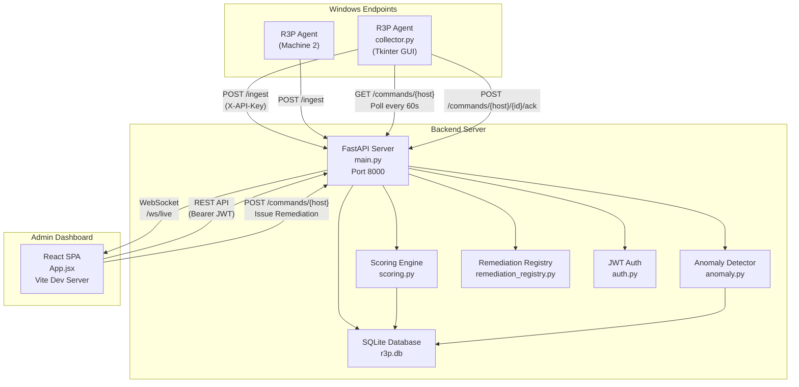
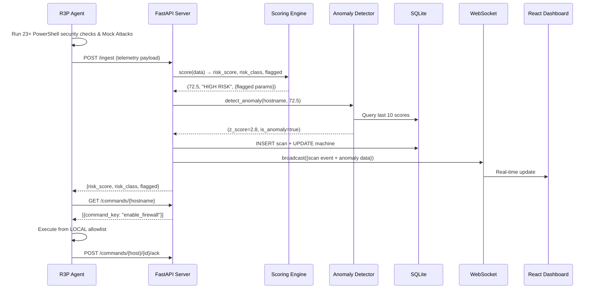

<p align="center">
  <strong>🛡 R3P — Ransomware Readiness & Risk Profiler</strong>
</p>

<p align="center">
  <em>Comprehensive Internal Architecture, Algorithms, & Academic Documentation</em>
</p>

---

## 📋 Table of Contents

1. [Abstract](#abstract)
2. [Problem Statement](#problem-statement)
3. [Scope & Objectives](#scope--objectives)
4. [System Architecture](#system-architecture)
5. [Technology Stack](#technology-stack)
6. [Key Features](#key-features)
7. [Ransomware Kill-Chain Model](#ransomware-kill-chain-model)
8. [MITRE ATT&CK Mapping](#mitre-attck-mapping)
9. [Risk Scoring Formula](#risk-scoring-formula)
10. [Anomaly Detection Algorithm](#anomaly-detection-algorithm)
11. [Remediation Engine](#remediation-engine)
12. [Security Model](#security-model)
13. [API Reference](#api-reference)
14. [Presentation Q&A](#presentation-qa--viva-preparation)
15. [Future Work](#future-work)
16. [References](#references)

---

## Abstract

**R3P (Ransomware Readiness & Risk Profiler)** is a client-server platform designed to continuously assess the ransomware resilience of Windows endpoints. It deploys a lightweight agent on each Windows machine that collects **23+ security configuration data points** (including Active Validation tests) mapped to the **MITRE ATT&CK** framework, transmits telemetry to a centralized FastAPI backend, and computes a **severity-weighted risk score (0–100)** using a custom formula.

The platform features:
- A **rolling z-score anomaly detection engine** that identifies sudden security posture changes (Posture Drift).
- A **real-time React admin dashboard** with WebSocket live updates.
- An **automated remediation system** that executes pre-approved PowerShell fixes on endpoints.
- **Active Validation (Mock Attacks)** that simulate ransomware behaviors to verify EDR effectiveness.
- **JWT-secured admin authentication** and API-key-secured agent communication.

Unlike traditional vulnerability scanners that focus on known CVEs, R3P assesses **misconfiguration posture** — the settings and policies that determine whether ransomware can execute, spread, and prevent recovery. This proactive approach is aligned with frameworks like NIST CSF and CIS Benchmarks.

---

## Problem Statement

Ransomware attacks cause an estimated **$20 billion in damages globally per year** (Cybersecurity Ventures, 2025). Studies show that **80% of successful ransomware attacks exploit misconfigurations**, not zero-day vulnerabilities:

| Attack Vector | % of Ransomware Incidents | R3P Coverage |
|---|---|---|
| Exposed RDP ports | 50–70% | ✅ `rdp_open` check |
| Disabled antivirus | 40–60% | ✅ `defender_disabled` check |
| Unrestricted PowerShell | 30–50% | ✅ `powershell_unrestricted` check |
| Deleted Volume Shadow Copies | 90%+ (post-compromise) | ✅ `vss_deleted` check |
| Unprotected LSASS | 60–80% (lateral movement) | ✅ `lsass_protection_off` check |

**The gap**: Organizations know they should harden endpoints, but lack a tool that:
1. Continuously monitors configuration drift (not just point-in-time scans)
2. Quantifies risk with a meaningful score (not just pass/fail checklists)
3. Maps findings to an industry framework (MITRE ATT&CK)
4. Actively tests endpoint security via behavioral simulation (Mock Attacks)
5. Detects sudden changes (anomaly detection)
6. Enables one-click remediation from a central dashboard

R3P fills this gap.

---

## Scope & Objectives

### In Scope
- ✅ Continuous agent-based telemetry collection (23+ security parameters)
- ✅ Active Validation: Simulation of VSS enumeration and Mass File Renaming
- ✅ Advanced configuration checks (BYOVD blocklists, HVCI, ASR Rules)
- ✅ Severity-weighted risk scoring with escalation rules
- ✅ MITRE ATT&CK technique mapping for all data points
- ✅ Rolling z-score anomaly detection for behavioral drift
- ✅ Real-time WebSocket dashboard with live fleet monitoring
- ✅ Remote automated remediation (PowerShell fix commands)
- ✅ JWT-secured admin authentication
- ✅ Remediation command tracking with full audit trail

### Out of Scope (Future Work)
- ❌ Network self-isolation / quarantine
- ❌ Machine learning classifiers (neural networks, random forests)
- ❌ CVE/patch vulnerability scanning
- ❌ Cross-platform support (Linux/macOS agents)

---

## System Architecture



### Data Flow (Per Scan Cycle — Every 60 Seconds)



---

## Infrastructure & Containerization (Docker)

To ensure academic reproducibility and enterprise-grade robustness, the R3P server architecture is fully containerized using **Docker** and orchestrated via **Docker Compose**.

### Microservice Isolation
1. **Backend Service (`backend/Dockerfile`)**: Built on `python:3.10-slim`. It completely isolates the FastAPI server, Uvicorn, and Python dependencies, preventing local environment pollution.
2. **Frontend Service (`frontend/Dockerfile`)**: Built on `node:20-slim`. It isolates the React/Vite development server. A specific `.dockerignore` strategy prevents host `package-lock.json` and native binding conflicts (e.g., `rolldown` linux-x64-gnu mismatches).

### Stateful Data Persistence
While the containers are ephemeral, the database is stateful. `docker-compose.yml` mounts the host's `backend/` directory into the container's `/app` volume. This provides two massive benefits:
1. **Live Reloading:** Any code edits made on the host immediately reflect in the container.
2. **Database Persistence:** The `r3p.db` SQLite file physically resides on the host machine, guaranteeing that telemetry data survives container restarts and image rebuilds.

---

## Technology Stack

| Layer | Technology | Purpose | Why This Choice |
|---|---|---|---|
| **Agent** | Python 3.10+ | Telemetry collector | Cross-compatible, rich Windows API access via subprocess |
| **Agent GUI** | Tkinter | Visual monitoring interface | Built into Python stdlib, zero dependencies |
| **Agent Packaging** | PyInstaller | Single .exe distribution | No Python needed on target machines |
| **Backend** | FastAPI | REST API + WebSocket server | Async, automatic OpenAPI docs, type validation |
| **ORM** | SQLAlchemy | Database abstraction | Database-agnostic (swap SQLite → PostgreSQL with 1 line) |
| **Database** | SQLite (WAL mode) | Persistent storage | Zero-config, file-based, handles ~100 writes/sec |
| **Auth** | JWT (PyJWT) + PBKDF2 | Admin authentication | Industry standard, no external auth server needed |
| **Frontend** | React 18 + Vite | Admin dashboard SPA | Component-based, fast hot reload, rich ecosystem |
| **Real-time** | WebSocket | Live scan event streaming | Native browser support, low latency |
| **Styling** | Vanilla CSS | Dashboard design system | Full control, no framework overhead |
| **Containerization** | Docker & Docker Compose | Microservice orchestration | Ensures identical development and production environments, isolates dependencies |
| **Unit Testing** | PyTest | Mathematical validation | Proves the exactness of the risk scoring and asset criticality algorithms |

---

## Key Features

### 1. 23-Point Security Telemetry
The agent runs 23+ PowerShell-based checks covering the full ransomware kill chain — from initial access through recovery prevention. Each check returns a boolean indicating whether a misconfiguration is present.

### 2. Active Validation (Mock Attacks)
In addition to passive configuration checks, R3P actively simulates ransomware behaviors:
- **VSS Enumeration:** Attempts to list Volume Shadow Copies (T1490).
- **Mass File Rename:** Attempts to drop 100 dummy files and rapidly rename them to `.locked` (T1486).
If the endpoint's EDR/Antivirus fails to block these mock attacks, the endpoint is immediately flagged as CRITICAL risk.

### 3. MITRE ATT&CK Framework Mapping
Every security check is mapped to an official MITRE ATT&CK technique ID, providing industry-standard context for each finding.

### 4. Severity-Weighted Risk Scoring (0–100)
A custom formula assigns weights (1–5) to each parameter based on exploit severity. The score is normalized to 0–100 with an escalation rule: any single critical failure (weight 5) escalates the classification to at least "HIGH RISK."

### 5. Rolling Z-Score Anomaly Detection
A statistical anomaly detector tracks each machine's risk score over time and flags deviations exceeding 2 standard deviations from the rolling mean. This catches scenarios like "a machine that was SAFE yesterday suddenly jumped to CRITICAL."

### 6. Real-Time WebSocket Dashboard
Admin dashboard receives live scan events via WebSocket — no page refresh needed. New scans update the fleet table, risk scores, and anomaly alerts instantly.

### 7. Automated Remediation
Admins can issue one-click fixes from the dashboard. The command key is sent to the agent, which executes the corresponding PowerShell script from a local allowlist (never arbitrary code).

---

## Ransomware Kill-Chain Model

R3P organizes its security checks into a **6-phase** model:

| Phase | Security Check | What It Detects |
|---|---|---|
| **Entry Vector** | SMBv1 Enabled | WannaCry/NotPetya exploit vector |
| | RDP Port 3389 Open | Brute-force / credential-stuffing entry point |
| | USB AutoRun Enabled | Removable media auto-execution |
| | Open Network Shares | Unrestricted shares accessible to "Everyone" |
| **Execution** | Office Macros Enabled | Malicious document payloads |
| | PowerShell Unrestricted | Script-based malware execution |
| | UAC Disabled | Silent privilege escalation |
| | No AppLocker Policy | No application whitelisting |
| **Evasion & Persistence** | Windows Defender Off | No real-time malware detection |
| | Windows Firewall Disabled | All ports exposed to network |
| | Tamper Protection Off | Defender settings modifiable by malware |
| | Event Logging Disabled | Attack activity invisible |
| | Vulnerable Driver Blocklist Off | Allows BYOVD (Bring Your Own Vulnerable Driver) to kill EDR |
| | HVCI Disabled | Allows Kernel-level exploitation |
| | ASR Rules Missing | Attack Surface Reduction rules missing |
| **Lateral Movement** | Admin Shares Active | C$/ADMIN$ enable network-wide spread |
| | LSASS Unprotected | Credential dumping via Mimikatz |
| | Guest Account Enabled | Unauthenticated network access |
| **Recovery Prevention** | No Volume Shadow Copies | No local rollback capability |
| | Backup Not Configured | No recovery after encryption |
| | BitLocker Off | Stolen drives expose all data |
| **Active Validation (Mock Attacks)** | VSS Enumeration Mock | Simulates VSS deletion reconnaissance |
| | Mass Rename Mock | Simulates rapid file encryption behavior |

---

## MITRE ATT&CK Mapping

Every R3P security check maps to one or more **MITRE ATT&CK** techniques. This provides academic rigor and industry-standard context for each finding.

| Kill-Chain Phase | Security Check | MITRE Technique ID | MITRE Technique Name |
|---|---|---|---|
| Entry Vector | SMBv1 Enabled | **T1210** | Exploitation of Remote Services |
| Entry Vector | RDP Open | **T1021.001** | Remote Desktop Protocol |
| Entry Vector | AutoRun Enabled | **T1091** | Replication Through Removable Media |
| Entry Vector | Open Network Shares | **T1021.002** | SMB/Windows Admin Shares |
| Execution | Macros Enabled | **T1204.002** | Malicious File |
| Execution | PowerShell Unrestricted | **T1059.001** | PowerShell |
| Execution | UAC Disabled | **T1548.002** | Bypass User Account Control |
| Execution | No AppLocker | **T1204** | User Execution |
| Evasion | Defender Off | **T1562.001** | Disable or Modify Tools |
| Evasion | Firewall Off | **T1562.004** | Disable or Modify System Firewall |
| Evasion | Tamper Protection Off | **T1562.001** | Disable or Modify Tools |
| Evasion | Vulnerable Driver Blocklist Off | **T1068** | Exploitation for Privilege Escalation (BYOVD) |
| Evasion | HVCI Disabled | **T1562.001** | Disable or Modify Tools |
| Evasion | ASR Rules Missing | **T1562.001** | Disable or Modify Tools |
| Lateral Movement | Admin Shares | **T1021.002** | SMB/Windows Admin Shares |
| Lateral Movement | LSASS Unprotected | **T1003.001** | LSASS Memory |
| Lateral Movement | Guest Account | **T1078.001** | Default Accounts |
| Recovery Prevention | VSS Deleted | **T1490** | Inhibit System Recovery |
| Active Validation | VSS Enumeration Mock | **T1490** | Inhibit System Recovery |
| Active Validation | Mass Rename Mock | **T1486** | Data Encrypted for Impact |

> **Reference**: MITRE ATT&CK® Framework v15 — https://attack.mitre.org/

---

## Risk Scoring Formula

The R3P scoring engine does not simply count the number of failed checks. It computes a deeply contextual, severity-weighted risk score by evaluating three specific multipliers for every single check.

### 1. The Multipliers

1. **Severity (1.0 to 5.0)**: Measures the raw destructive potential of the misconfiguration.
   - *Example:* USB AutoRun is a `2.0` (Low). SMBv1 is a `5.0` (Critical) because it allows instant, worm-like network propagation (e.g., WannaCry).
2. **Likelihood (0.1 to 1.0)**: Measures the statistical probability of real-world exploitation.
   - *Example:* SMBv1 is devastating but aging, so it carries a `0.4` likelihood. An open RDP port (3389) is the #1 ransomware vector today, carrying a `0.9` likelihood.
3. **Asset Criticality (1.0 to 1.6)**: Contextualizes the target machine's value.
   - *Workstation* = `1.0` (Standard employee laptop)
   - *Server* = `1.3` (Holds departmental data)
   - *Domain Controller* = `1.6` (The keys to the kingdom)

### 2. The Formula

For every parameter that fails (indicates a misconfiguration), the engine calculates the itemized risk:

```
Item Risk = Severity × Likelihood × AssetCriticality
```

It then calculates the **Max Possible Risk** (the theoretical score if a baseline Workstation failed every single check in the database).

```
Final Score = (Σ Item Risk) / (Max Possible Risk) × 100
```
This yields a clean, normalized percentage from **0 to 100**.

### 3. The "Failsafe" Escalation Rule

Because the final score is an aggregate average, a mathematical loophole exists: A machine could be perfectly secure in 26 categories but fail 1 critical category (e.g., Antivirus completely disabled). Mathematically, the score might be `15/100`, which the system normally classifies as `"SAFE"`. 

**This would be a dangerous false positive.**

To prevent this, R3P employs a failsafe **Escalation Rule**:
> If the engine detects a failure on **any single parameter with a Weight of 5 (Critical)**, it immediately bypasses the mathematical classification and escalates the machine to **at least HIGH RISK**, regardless of how low the numerical score is.

---

## Automated Verification & Unit Testing

To prove the mathematical correctness of the Risk Scoring Formula, R3P utilizes the **PyTest** automated testing framework. 

The test suite (`backend/tests/test_scoring.py`) instantiates fake `CollectorData` payloads in memory and asserts that the `scoring.py` engine produces mathematically flawless outputs in under 10 milliseconds. 

**Tested Scenarios:**
1. **The Baseline:** Asserts that a perfectly secured payload mathematically results in exactly `0.0` risk and a `"SAFE"` classification.
2. **The Escalation:** Asserts that injecting a single weight-5 vulnerability (e.g., SMBv1) into an otherwise secure machine forces the classification engine to override the baseline and return `"HIGH RISK"`.
3. **The Multiplier:** Asserts that two identical telemetry payloads passed into the engine yield vastly different scores when one is tagged as a `"Workstation"` and the other as a `"Domain Controller"`, proving the Context-Aware mathematics.

---

## Anomaly Detection Algorithm

### Method: Rolling Z-Score

R3P uses a **rolling z-score** to detect sudden behavioral changes in a machine's risk posture. This is a standard statistical method for univariate time-series anomaly detection.

### Formula

```
z = (x - μ) / σ
```

Where:
- `x` = current scan's risk score
- `μ` = rolling mean of the last N scores (default N=10)
- `σ` = rolling standard deviation of the last N scores
- **Anomaly threshold**: |z| > 2.0

### Why Z-Score Over Machine Learning?

| Approach | Z-Score (R3P) | Isolation Forest | Neural Network |
|---|---|---|---|
| Training data needed | None (works from scan #3) | Yes (100+ samples) | Yes (1000+ samples) |
| Explainability | Full (one formula) | Partial | None (black box) |
| Viva defensibility | Easy to explain in 2 min | Moderate | Hard to justify for boolean arrays |
| Computational cost | O(N) per scan | O(N log N) | O(N²) |

> **Academic answer**: "Z-score is the standard method for univariate time-series anomaly detection. Our signal is a single scalar (risk score 0–100) derived from boolean inputs. Using a neural network for this would be over-engineering — equivalent to using a sledgehammer to crack a nut."

---

## Remediation Engine

### Security Model

```
┌─────────────┐                    ┌─────────────┐
│  Dashboard   │ ──command_key──→  │   Backend    │  ← validates key exists
│  (Admin)     │                   │   (FastAPI)  │     in allowlist
└─────────────┘                    └──────┬───────┘
                                          │
                                   command_key only
                                   (no PowerShell)
                                          │
                                          ▼
                                   ┌─────────────┐
                                   │   Agent      │  ← validates key exists
                                   │ (collector)  │     in LOCAL allowlist
                                   └──────┬───────┘
                                          │
                                   Executes from local
                                   AGENT_REMEDIATION dict
                                          │
                                          ▼
                                   PowerShell runs locally
```

**Key security property**: No arbitrary code ever crosses the network. Only a string key (e.g., `"enable_firewall"`) is transmitted. Both the server and the agent independently validate the key against their own allowlists before any action is taken.

---

## Presentation Q&A / Viva Preparation

### Q: Why not use a neural network for anomaly detection?
> "Our signal is a single scalar — a risk score from 0 to 100 — derived from a set of boolean inputs. Z-score is the standard statistical method for univariate time-series anomaly detection. It requires no training data, works from the third scan onwards, and I can explain the entire algorithm in one formula: z equals x minus mu over sigma. A neural network would be over-engineering for this problem — it would require thousands of training samples we don't have, introduce a black-box element that's hard to justify academically, and wouldn't improve detection quality."

### Q: Can this scale to 50–100 machines?
> "Yes. The current SQLite database handles approximately 100 writes per second. With 70 agents scanning every 60 seconds, that's 1.2 writes per second — about 1% of capacity. The ORM layer (SQLAlchemy) is database-agnostic, so migrating to PostgreSQL requires changing only the `DATABASE_URL` environment variable and installing `psycopg2`. No application code changes are needed."

### Q: How is the remediation system secure?
> "No arbitrary code ever crosses the network. Only a string key like 'enable_firewall' is transmitted. Both the server and the agent independently validate this key against their own allowlists before any action is taken. The actual PowerShell command is defined locally in the agent's `AGENT_REMEDIATION` dictionary. Even if the network is compromised, an attacker cannot inject arbitrary commands — they can only trigger the pre-approved fixes."

### Q: How does the Active Validation (Mock Attack) differ from a real attack?
> "A real attack uses destructive APIs to delete actual shadow copies or encrypt critical files. Our mock attack uses non-destructive, read-only equivalent behaviors (e.g., querying WMI for shadow copies, or dropping a temporary set of dummy files in a temp folder and renaming them). This generates the exact same behavioral signature that an EDR looks for, triggering a block without causing any actual damage."

---

## Future Work

1. **PostgreSQL Migration** — Swap `DATABASE_URL` for production deployments with hundreds of agents
2. **Windows Service Mode** — Headless agent for production deployment (`sc create` or NSSM)
3. **Network Quarantine** — Disable network adapters on critically compromised machines (requires careful safeguards)
4. **Email/SMS Alerts** — Notify admins of critical anomalies via external notification channels
5. **Multi-Tenant Support** — Separate dashboards for different organizational units

---

## References

1. MITRE ATT&CK® Framework v15 — https://attack.mitre.org/
2. CIS Microsoft Windows Benchmarks — https://www.cisecurity.org/benchmark/microsoft_windows
3. NIST Cybersecurity Framework 2.0 — https://www.nist.gov/cyberframework
4. Cybersecurity Ventures, "Global Ransomware Damage Costs" (2025)
5. Chandola, V., Banerjee, A., & Kumar, V. (2009). "Anomaly Detection: A Survey." ACM Computing Surveys.
